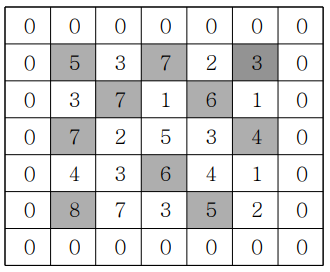

## ✍🏻 제목 : 봉우리
지도 정보가 N*N 격자판에 주어집니다. 각 격자에는 그 지역의 높이가 쓰여있습니다. 각 격자판의 숫자 중 자신의 상하좌우 숫자보다 큰 숫자는 봉우리 지역입니다. 봉우리 지역이 몇 개 있는 지 알아내는 프로그램을 작성하세요. 

격자의 가장자리는 0으로 초기화 되었다고 가정한다. 만약 N=5 이고, 격자판의 숫자가 다음과 같다면 봉우리의 개수는 10개입니다.



</br>

- `입력조건` : 첫 줄에 자연수 N이 주어진다.(1<=N<=50) 
두 번째 줄부터 N줄에 걸쳐 각 줄에 N개의 자연수가 주어진다. 각 자연수는 100을 넘지 않는다.

- `출력조건` : 봉우리의 개수를 출력하세요.

</br>

|입력예시|출력예시|
|:------:|:----:|
|5</br>5 3 7 2 3</br>3 7 1 6 1</br>7 2 5 3 4</br>4 3 6 4 1</br>8 7 3 5 2|10|


</br>

---

### 🔍 이렇게 접근 했어요 !

```javascript
const dx = [-1, 1, 0, 0]
const dy = [0, 0, -1, 1]
```
우선 상하좌우 탐색을 위한 배열 2개를 만들어준다. 위를 탐색할 때는 행만 -1되기 때문에 dx[0] = -1, dy[0] = 0로 설정해준 것이다. 나머지 방향도 해당 규칙에 따라 초기화되었다.
```javascript
for(let i = 0; i < n; i++) {
    for(let j = 0; j < n; j++) {
        let flag = 1;
        for(let k = 0; k < 4; k++) { 
            let nx = i + dx[k];
            let ny = j + dy[k];
            if(nx >= 0 && nx < n && ny >= 0 && ny < n) {
                if(heightArr[nx][ny] >= heightArr[i][j]){
                    flag = 0;
                    break;
                } 
            }
        }
        if(flag) count++;
    }
}
```
가장 바깥쪽 for문은 `행`을, 두번째 for문은 `열`을, 마지막 for문은 `방향` 탐색을 위해 사용된다.그렇기 때문에 마지막 for문의 반복 횟수는 4이하 이다. (방향 탐색이 4번 즉, 0 ~ 3까지이기 때문) 방향 탐색시 현재의 방향에서 탐색하려는 방향의 배열(`dx, dy`)을 적용하여 상하좌우 탐색 위치를 `nx, ny`에 담는다. 

그리고 지도를 벗어나면 안되기 때문에 조건문을 이용하여 **지도 안에 위치**할때만 높이를 비교할 수 있도록 한다. `flag` 변수는 현재 위치가 **봉우리**인지 확인하게 해주는 역할을 한다. 만약 반복이 끝나고 **flag가 0으로 바뀌지 않았다**면 `heightArr[nx][ny] >= heightArr[i][j]` 현재 위치가 해당 조건문을 만족하지 않았다는 의미(상하좌우의 높이보다 낮지 않았다는 의미)이므로 **봉우리**로 확정지을 수 있다.

마지막으로 봉우리 수를 세어주기 위하여 `flag`가 `1`, 즉 참이라면 `count`를 `1` 증가 시켜주어 개수를 세어준다.

</br>

---

### 🎉 새로 알게된 점은?
- 상하좌우의 높이 비교를 한 뒤 봉우리 판별을 어떻게 해주어야 하나 했는데 flag 변수를 이용해서 1, 0으로 봉우리 판별을 하는 것이 신기하였다. 아니면 true, false로 바꿔서 해도 될 것 같다.

- 상하좌우 탐색을 하는 것도 dx, dy 배열을 이용하여 상하좌우 이동에 사용될 수 있는 좌표의 변화를 나타내는 것도 아직은 어색하지만 적응이 되지 훨씬 유용할 것 같다! 대부분 이런 방식으로 쓰는 것도 같고..

</br>

---

### 🐾 회고
좌표 탐색 문제가 행, 열 이동이 아직도 헷갈리지만 더 잘 풀고 싶은 마음이 크기 때문에 앞으로 더 많은 좌표 이동 문제를 풀어보면서 실력을 쌓고 싶다. 다음에는 flag에 1, 0말고 true, false 적용해봐야지 !!