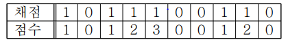

## ✍🏻 제목 : 점수 계산
OX 문제는 맞거나 틀린 두 경우의 답을 가지는 문제를 말한다. 여러 개의 OX 문제로 만들어진 시험에서 연속적으로 답을 맞히는 경우에는 가산점을 주기 위해서 다음과 같이 점수 계산을 하기로 하였다. 

1번 문제가 맞는 경우에는 1점으로 계산한다. 앞의 문제에 대해서는 답을 틀리다가 답이 맞는 처음 문제는 1점으로 계산한다. 또한, 연속으로 문제의 답이 맞는 경우에서 두 번째 문제는 2점, 세 번째 문제는 3점, ..., K번째 문제는 K점으로 계산한다. 틀린 문제는 0점으로 계산한다.

예를 들어, 아래와 같이 10 개의 OX 문제에서 답이 맞은 문제의 경우에는 1로 표시하고, 틀린 경우에는 0으로 표시하였을 때, 점수 계산은 아래 표와 같이 계산되어, 총 점수는 1+1+2+3+1+2=10 점이다.



- `입력조건` : 첫째 줄에 문제의 개수 N (1 ≤ N ≤ 100)이 주어진다. 둘째 줄에는 N개 문제의 채점 결과를 나타내는 0 혹은 1이 빈 칸을 사이에 두고 주어진다. 0은 문제의 답이 틀린 경우이고, 1은 문제의 답이 맞는 경우이다. 

- `출력조건` : 첫째 줄에 입력에서 주어진 채점 결과에 대하여 가산점을 고려한 총 점수를 출력한다.

|입력예시|출력예시|
|:------:|:----:|
|10</br>1 0 1 1 1 0 0 1 1 0|10|


</br>

---

### 🔍 이렇게 접근 했어요 !

```javascript
for(let i of numArr) {
    if(i == 1) {
        count++;
    } else {
        count = 0;
    }
    sum += count;
}
```
숫자 배열을 탐색하며 수가 `1`이라면 `count`를 **1증가** 시켜주어야 하며 1이 **연속적**으로 나타나면 연속적으로 나타나는 수만큼을 합에 더해주어야하기 때문에 후위 증감 연산자를 사용한 뒤, 조건문 탐색을 끝내면 바로 `sum`에 `count`를 더해주면 된다. 그리고 `0`이 등장하면 다시 0점으로 계산해야하기 때문에 `count`를 `0`으로 초기화해주어야 한다.

</br>

---

### 🐾 회고
전에는 문제를 파악하지도 않고 끙끙거리다가 해답을 봤는데 확실히 생각하는 힘이 점점 길러지는 것 같아서 너무 뿌듯하다 ! 