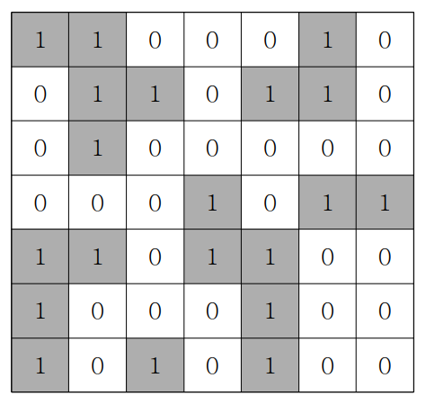
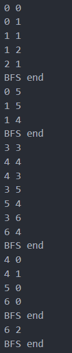

## ✍🏻 제목 : 섬나라 아일랜드(BFS 활용)
N*N의 섬나라 아일랜드의 지도가 격자판의 정보로 주어집니다. 각 섬은 1로 표시되어 상하좌우와 대각선으로 연결되어 있으며, 0은 바다입니다. 섬나라 아일랜드에 몇 개의 섬이 있는지 구하는 프로그램을 작성하세요.



만약 위와 같다면

- `입력조건` : 첫 번째 줄에 격자판 정보가 주어진다.

- `출력조건` : 첫 번째 줄에 섬의 개수를 출력한다.

|입력예시|출력예시|
|:------:|:----:|
|1 1 0 0 0 1 0</br>0 1 1 0 1 1 0</br>0 1 0 0 0 0 0</br>0 0 0 1 0 1 1</br>1 1 0 1 1 0 0</br>1 0 0 0 1 0 0</br>1 0 1 0 1 0 0|5|


</br>

---

### 🔍 이렇게 접근 했어요 !

```javascript
for(let i = 0; i < n; i++) {
    for(let j = 0; j < n; j++) {
        if(coorArr[i][j] === 1) {
            coorArr[i][j] = 0;
            queue.push([i, j]);
            answer++;

            while(queue.length) {
                let [x, y] = queue.shift();
                for(let k = 0; k < 8; k++) {
                    let nx = x + dx[k];
                    let ny = y + dy[k];

                    if(nx >= 0 && nx < n && ny >= 0 && ny < n && coorArr[nx][ny] === 1) {
                        coorArr[nx][ny] = 0;
                        queue.push([nx, ny]);
                    }
                }
            }
        }
    }
}
```

좌표를 구한 후, 섬(1)이면 queue에 push하고 while문에서 shift()해서 해당 좌표에서의 8방향에 섬이 있는지 탐색. 이 때 BFS에서의 출발점은 push한 값이다. 방향 탐색을 하며 섬 발견시 queue에 push하고 다시 while문에서 shift().
queue에 push시, coorArr[i][j]가 아니라 [i,j]를 보내주어야 한다. 다시 말해 1이나 0이 아닌 좌표 자체를 보내주는 것.

**탐색과정**



</br>

---

### 🎉 새로 알게된 점은?


</br>

---

### 🐾 회고