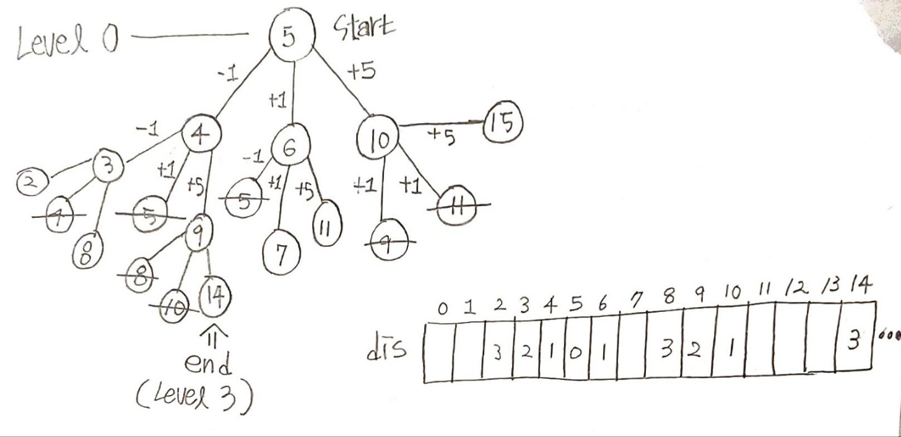

## ✍🏻 제목 : 송아지 찾기
현수는 송아지를 잃어버렸다. 다행히 송아지에는 위치추적기가 달려 있다. 현수의 위치와 송아지의 위치가 수직선상의 좌표 점으로 주어지면 현수는 현재 위치에서 송아지의 위치까지 다음과 같은 방법으로 이동한다. 송아지는 움직이지 않고 제자리에 있다. 

현수는 스카이 콩콩을 타고 가는데 한 번의 점프로 앞으로 1, 뒤로 1, 앞으로 5를 이동할 수 있다. 최소 몇 번의 점프로 현수가 송아지의 위치까지 갈 수 있는지 구하는 프로그램을 작성하세요.


- `입력조건` : 첫 번째 줄에 현수의 위치 S와 송아지의 위치 E가 주어진다. 직선의 좌표 점은 1부터 10,000까지이다.

- `출력조건` : 점프의 최소횟수를 구한다. 답은 1이상입니다.

|입력예시|출력예시|
|:------:|:----:|
|5 14|3|


</br>

---

### 🔍 이렇게 접근 했어요 !

```javascript
    let answer = 0;
    let check = Array.from({ length: 10001 }, () => 0);
    let dis = Array.from({ length: 10001 }, () => 0);
    let queue = [];
    check[hPos] = 1;
    queue.push(hPos);  // 현수의 위치 push
    dis[hPos] = 0;

    while(queue.length) {
        let x = queue.shift();  // 첫 출발 좌표 꺼내기 (5)

        // nx: next x
        for(let nx of [x - 1, x + 1, x + 5]) {
            // 송아지 위치 도달시
            // 지금까지 점프한 값(dis[x])에 nx까지 왔으니 +1
            if(nx === cPos) return dis[x] + 1;
            // 좌표 안에 있으면서 이미 탐색한 값이 아닐 때
            if(nx > 0 && nx <= 10000 && check[nx] === 0) {
                check[nx] = 1;
                queue.push(nx);
                dis[nx] = dis[x] + 1;
            }
        }
    }
```



</br>

---

### 🎉 새로 알게된 점은?
dis 배열을 이용하지 않고 Level로 답을 구할 수도 있다. 해당 방법이 메모리를 더 적게 사용하여 효율적인 방법이긴 하다.
