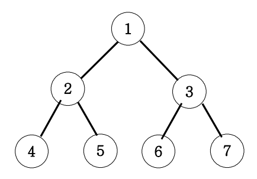

## ✍🏻 제목 : 이진트리 넓이우선탐색(BFS)

아래 그림과 같은 이진트리를 넓이우선탐색해 보세요.



넓이 우선 탐색 : 1 2 3 4 5 6 7

</br>

---

### 🔍 이렇게 접근 했어요 !

```javascript
    let queue = [];
    queue.push(1);

    // queue.length === 0 이면 queue가 비어있다는 의미. break 필요.
    while(queue.length) {
        // queue에서 꺼내기
        let v = queue.shift();
        answer += v + " ";  // v를 answer에 누적.

        // nv: next vertex
        for(let nv of [v * 2, v * 2 + 1]) {
            if(nv > 7) {
                continue;
            }
            queue.push(nv);
        }
    }
```
노드 1에서 가지가 뻗어나가므로 `queue`에 1을 `push()` queue가 비워질 때 까지(`queue.length === 0`) `while` 문을 이용해 queue에서 꺼낸 노드와 근접한 노드가 7보다 작거나 같으면 큐에 추가한다. 이진트리이므로 왼쪽 노드는 `v * 2`, 오른쪽 노드는 `v * 2 + 1`을 이용해 탐색해나간다. BFS를 이용한 탐색이기 때문에 같은 레벨을 노드를 왼쪽에서 오른쪽으로 탐색한 뒤 해당 레벨을 모든 노드 탐색이 끝나면 다음 레벨로 이동하면 된다.
