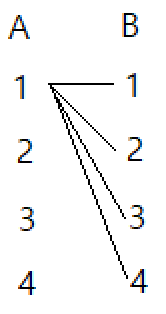

## ✍🏻 제목 : 멘토링
현수네 반 선생님은 반 학생들의 수학점수를 향상시키기 위해 멘토링 시스템을 만들려고 합니다. 멘토링은 멘토(도와주는 학생)와 멘티(도움을 받는 학생)가 한 짝이 되어 멘토가 멘티의 수학공부를 도와주는 것입니다. 

선생님은 M번의 수학테스트 등수를 가지고 멘토와 멘티를 정합니다. 만약 A학생이 멘토이고, B학생이 멘티가 되는 짝이 되었다면, A학생은 M번의 수학테스트에서 모두 B학생보다 등수가 앞서야 합니다. M번의 수학성적이 주어지면 멘토와 멘티가 되는 짝을 만들 수 있는 경우가 총 몇 가지 인지 
출력하는 프로그램을 작성하세요.

- `입력조건` : 첫 번째 줄에 반 학생 수 N(1<=N<=20)과 수학테스트 횟수 M(1<=M<=10)이 주어진다.두 번째 줄부터 M개의 줄에 걸쳐 수학테스트 결과가 학생번호로 주어진다. 학생번호가 제일 앞에서부터 1등, 2등, ...N등 순으로 표현된다. 

    만약 한 줄에 N=4이고, 테스트 결과가 3 4 1 2로 입력되었다면 3번 학생이 1등, 4번 학생이 2등, 1번 학생이 3등, 2번 학생이 4등을 의미합니다.


- `출력조건` : 첫 번째 줄에 짝을 만들 수 있는 총 경우를 출력합니다.

|입력예시|출력예시|
|:------:|:----:|
|4 3</br>3 4 1 2</br>4 3 2 1</br>3 1 4 2|3|

(3, 1), (3, 2), (4, 2)와 같이 3가지 경우의 (멘토, 멘티) 짝을 만들 수 있다.

</br>

---

### 🔍 이렇게 접근 했어요 !

```javascript
for(let i = 1; i <= rankArr[0].length; i++) {
        for(let j = 1; j <= rankArr[0].length; j++) {
            // 시험에 대한 반복문 시작 전 count를 0으로 초기화
            count = 0;
            for(let k = 0; k < rankArr.length; k++) {
                let pi = 0;
                let pj = 0;
                for(let s = 0; s < rankArr[0].length; s++) {
                    // k번째 시험, s 위치에 i번 학생이 있으면
                    if(rankArr[k][s] == i) pi = s;
                    if(rankArr[k][s] == j) pj = s;
                }
            if(pi > pj) count++;
            }
            // count가 시험을 본 횟수와 같다면 
            if(count == rankArr.length) {
                tmp.push("[" + [i, j] + "]");
                answer++;
            }
        }
    }
```
멘토(A), 멘티(B) 경우의 수 (해당 입력의 경우로는 4 X 4)라는 걸 상기하자. 아래 그림은 1 X 4의 경우다. A가 4명이니 결과적으로는 4 X 4의 경우의 수가 나온다.



우선 `i`, `j`로 학생 수 만큼 돌며 **멘토, 멘티 경우의 수** 구한다. ex) (1, 1) , (1, 2) ...

`count`는 멘토가 멘티보다 **모든 테스트에서 등수가 앞섰**을 때 카운트하기 위한 변수이다.
그런 다음 **시험 횟수**만큼 반복문을 돌며 `pi`, `pj`를 이용해 현재 탐색중인 시험에서 **멘토와 멘티의 위치**를 찾는다. 그런 다음 s를 돌며 해당 위치에 멘토(`i`)가 있으면 `pi`에 저장하고 멘티(`j`)가 있으면 `pj`에 저장한다.

s를 다 돈 뒤, `pi`와 `pj`를 비교하고 **멘토가 멘티보다 테스트마다 등수가 앞선** 경우, `count`를 **증가**시킨다. 다음 멘토, 멘티의 등수 경우를 체크해야하기 때문에 k를 돌기 전 `count`를 `0`으로 초기화 시켜주어야한다. 

그리고 k를 다 돈 뒤에 `count`가 시험을 본 횟수(`rankArr.length`)와 같다면 해당 멘토가 멘티보다 시험에서 **전부 등수가 앞선 것**이기 때문에 `tmp`배열에 추가해준다. 그리고 **경우의 수**를 구하여야 하기 때문에 `answer`도 `1` 증가 시켜준다.

</br>

---

### 🎉 새로 알게된 점은?
완전 탐색 유형에 대해 잘모르는 것 같다고 생각해서 다시 정리하며 새로 알게된 것은..

완전 탐색은 입력으로 주어지는 데이터의 크기가 매우 작다. 완전 탐색은 모든 경우들을 다 구하는 방법이기 때문에 부분집합, 순열같은 문제들은 완전 탐색으로 푼다면 기본적으로 시간 복잡도가 O(2^N)이나, O(N!)으로 좋지 못하기 때문에 데이터의 크기가 다른 문제들에 비해 작을 수 밖에 없다.

데이터가 현저히 작다면 의심해 볼 필요가 있을 것 같다! 지금은 미숙하니 이런식으로라도 유형을 구분하는 수 밖에..

</br>

---

### 🐾 회고
완전 탐색이 모든 경우의 수를 구하는 것이라는 걸 자꾸 까먹는다.. 왜? 정확히 몰라서이기 때문이지 않을까.. yes.. 허접해서인듯 하다 ^___^ 그래도 코드가 왜 이렇게 쓰였는지 정확하게 알게 되면 쾌감이 장난아닌 것 같다. 이번 문제를 해결할 때도 count == rankArr.length 이 부부이 왜 같아야 경우의 수를 추가해줄까 생각하다가 그 답이 생각나서 무척 기뻤었다.