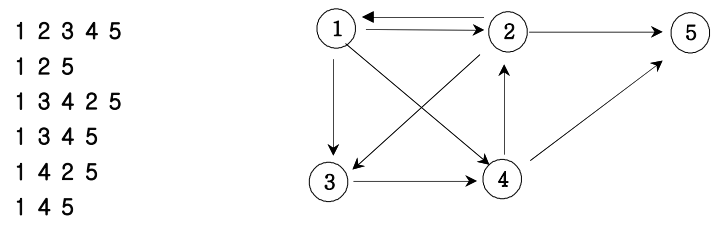
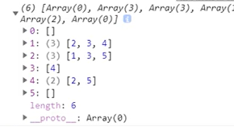

## ✍🏻 제목 : 경로탐색 (인접리스트)
방향그래프가 주어지면 1번 정점에서 N번 정점으로 가는 모든 경로의 가지 수를 출력하는 프로그램을 작성하세요. 아래 그래프에서 1번 정점에서 5번 정점으로 가는 가지 수는



총 6 가지입니다.

- `입력조건` : 첫째 줄에는 정점의 수 N(1<=N<=20)와 간선의 수 M가 주어진다. 그 다음부터 M줄에 걸쳐 연결정보가 주어진다.

- `출력조건` : 총 가지수를 출력한다.

|입력예시|출력예시|
|:------:|:----:|
|5 9</br>1 2</br>1 3</br>1 4</br>2 1</br>2 3</br>2 5</br>3 4</br>4 2</br>4 5|6|

</br>

---

### 🔍 이렇게 접근 했어요 !

```javascript
    let answer = 0;
    // n + 1행과 빈 열
    let graph = Array.from(Array(n + 1), () => Array());
    let check = Array.from({ length: n + 1 }, () => 0);

    for(let [a, b] of nArr) {
        graph[a].push(b);  // 인접리스트 생성
    }

    function DFS(v) {
        if(v === n) answer++;
        else {
            // 인접리스트의 길이(연결되어있는 노드수)만큼 반복 탐색
            for(let i = 0; i <= graph[v].length; i++) {
                // v 정점에서 이동 가능한 정점 번호: graph[v][i] 
                if(check[graph[v][i]] === 0) {
                    check[graph[v][i]] = 1;
                    DFS(graph[v][i]);
                    check[graph[v][i]] = 0;
                }
            }
        }
    }
```
인접 리스트의 경우엔 행이 그대로 정점 번호가 될 것이므로 1부터 시작해야 한다. 열은 만약 해당 정점이 2라는 정점을 갈 수 있다고 하면, 해당 정점행에 2값을 push해서 넣을 것이므로 굳이 정점수대로 열을 만들지 않아도 된다.(`() => Array()`)

인접리스트 생성(`graph[a].push(b)`) 확인


연결되어 있지 않은 노드도 전체적으로 반복 탐색해야하는 인접행렬과 달리 인접리스트에 이미 정점의 번호들이 push되어 있으므로 해당 열만큼만(`i <= graph[v].length`) 탐색해주면 된다.

</br>

---

### 🎉 새로 알게된 점은?
경로탐색을 인접행렬로 할 시, 메모리가 낭비되고 시간 복잡도도 증가하여 굉장히 효율적이지 못하게 된다. 한 노드와 실제로 연결된 노드가 5개뿐이어도 인접행렬로 풀이시 노드가 100,000개라면 반복문을 통해 100,000을 다 돌아야한다는 의미이다.

다만, 인접리스트는 각 노드에 대한 간선 연결정보를 담는 형식이기에 메모리는 간선의 갯수만큼만 필요하지만 간선이 많으면 인접리스트의 장점이 무색해진다는 점을 유의해서 사용해야한다. 