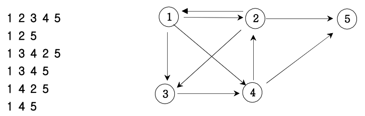
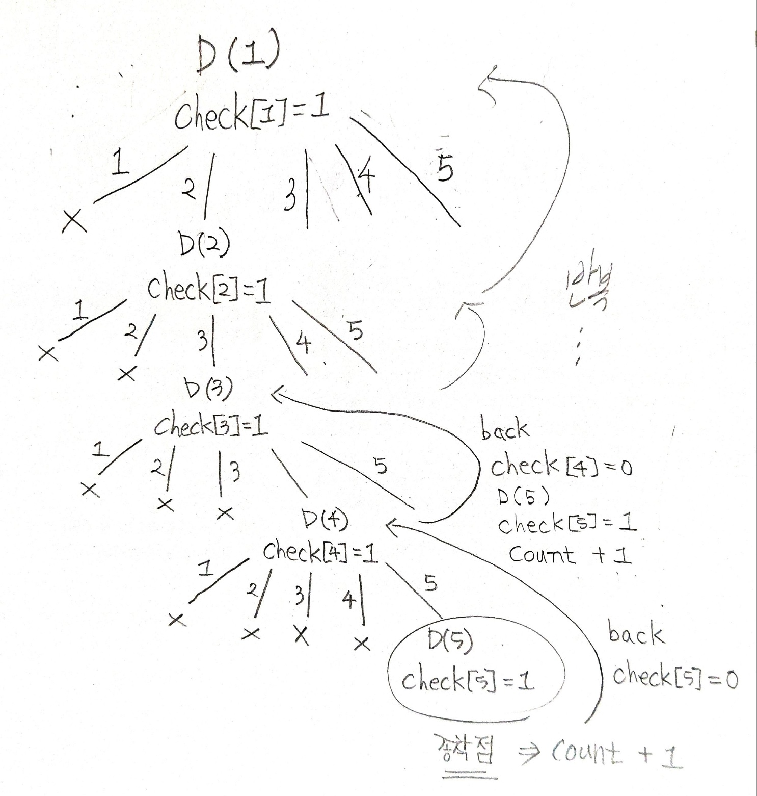

## ✍🏻 제목 : 경로 탐색 (인접 행렬)
방향그래프가 주어지면 1번 정점에서 N번 정점으로 가는 모든 경로의 가지 수를 출력하는 프로그램을 작성하세요. 아래 그래프에서 1번 정점에서 5번 정점으로 가는 가지 수는



총 6 가지입니다.

- `입력조건` : 첫째 줄에는 정점의 수 N(1<=N<=20)와 간선의 수 M가 주어진다. 그 다음부터 M줄에 걸쳐 연결정보가 주어진다.

- `출력조건` : 총 가지수를 출력한다.

|입력예시|출력예시|
|:------:|:----:|
|5 9</br>1 2</br>1 3</br>1 4</br>2 1</br>2 3</br>2 5</br>3 4</br>4 2</br>4 5|6|


</br>

---

### 🔍 이렇게 접근 했어요 !

```javascript
function solution(n, nArr) {
    let answer = 0;

    // 인접행렬 배열
    // index 0번째 배열의 원소는 사용하지 않고 비워놓을 것이기 때문에 n + 1개로 설정.
    //                    행의 개수(n + 1)개, 열의 개수(n + 1)개
    let graph = Array.from(Array(n + 1), () => Array(n + 1).fill(0));
    let check = Array.from({ length: n + 1 }, () => 0);

    for(let [a, b] of nArr) {
        graph[a][b] = 1;
    }

    // v: vertex
    function DFS(v) {
        // 종착점일 시 count +1
        if(v === n) answer++;
        else {
            for(let i = 1; i <= n; i++) {
                if(graph[v][i] === 1 && check[i] === 0) {
                    check[i] = 1;
                    DFS(i);
                    check[i] = 0;  // back 지점
                }
            }
        }
    }
    // DFS() 첫 호출 전 첫 방문 노드 체크해주지 않으면 경로 탐색시 경로 반복의 위험 있음.
    check[1] = 1;
    DFS(1);
    return answer;
}
```

방문한 노드를 다시 방문하는 일이 없도록 check 배열을 이용해 방문한 노드를 체크해준다. 그리고 DFS()를 호출하고 종료되면 해당 check[]를 다음에 다시 경로로 사용할 수 있도록 0으로 재할당한다. (백트래킹)


