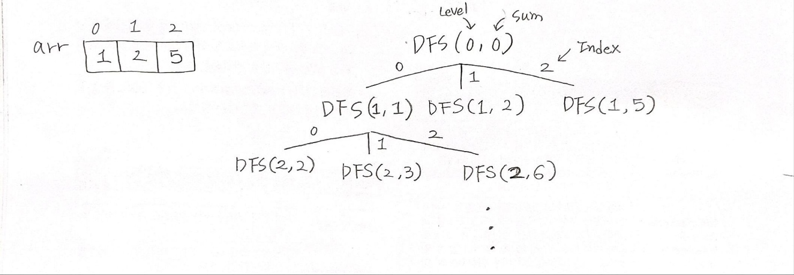

## ✍🏻 제목 : 동전교환
다음과 같이 여러 단위의 동전들이 주어져 있을때 거스름돈을 가장 적은 수의 동전으로 교환해주려면 어떻게 주면 되는가? 각 단위의 동전은 무한정 쓸 수 있다.

- `입력조건` : 첫 번째 줄에는 동전의 종류개수 N(1<=N<=12)이 주어진다. 두 번째 줄에는 N개의 동전의 종류가 주어지고, 그 다음줄에 거슬러 줄 금액 M(1 <= M <= 500)이 주어진다. 각 동전의 종류는 100원을 넘지 않는다.

- `출력조건` : 첫 번째 줄에 거슬러 줄 동전의 최소개수를 출력한다.

|입력예시|출력예시|
|:------:|:----:|
|3</br>1 2 5</br>15|3|


</br>

---

### 🔍 이렇게 접근 했어요 !

```javascript
function DFS(L, sum) {
    if(sum > price) return;
    if(L >= answer) return;
    if(sum == price) {
        answer = Math.min(answer, L);
    } else {
        for(let i = 0; i < n; i++) {
            DFS(L + 1, sum + coinT[i]);
        }
    }
}
```

L이 현재 answer보다 크거나 같다면 가지를 계속 뻗어나갈 필요가 없다. 왜냐, 이미 그것보다 최적의 답이 있기에 굳이 더 큰 L의 가지를 탐색하는 것은 효율성이 떨어지기 때문에 `L >= answer`라면 return 해주는 것이 좋다.


