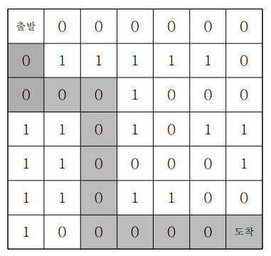

## ✍🏻 제목 : 미로 탐색
7*7 격자판 미로를 탈출하는 경로의 가지수를 출력하는 프로그램을 작성하세요. 출발점은 격자의 (1, 1) 좌표이고, 탈출 도착점은 (7, 7)좌표이다. 격자판의 1은 벽이고, 0은 통로이다. 격자판의 움직임은 상하좌우로만 움직인다. 미로가 다음과 같다면



위의 지도에서 출발점에서 도착점까지 갈 수 있는 방법의 수는 8가지이다.

- `입력조건` : 7 * 7 격자판의 정보가 주어집니다.

- `출력조건` : 첫 번째 줄에 경로의 가지수를 출력한다.

|입력예시|출력예시|
|:------:|:----:|
|0 0 0 0 0 0 0</br>0 1 1 1 1 1 0</br>0 0 0 1 0 0 0</br>1 1 0 1 0 1 1</br>1 1 0 0 0 0 1</br>1 1 0 1 1 0 0</br>1 0 0 0 0 0 0|8|


</br>

---

### 🔍 이렇게 접근 했어요 !

```javascript
    //          좌 상 우 하
    const dx = [-1, 0, 1, 0];
    const dy = [0, 1, 0, -1];

    function DFS(x, y) {
        // 도착점이 도달한 경우
        if(x === rArr.length - 1 && y === rArr[0].length - 1) {
            answer++;
        } else {
            // 상하좌우 네 번 반복
            for(let i = 0; i < 4; i++) {
                let nx = x + dx[i];
                let ny = y + dy[i];

                // 격자 경계를 안 쪽에서 탐색하도록 + 경로가 통로인 경우(배열 요소가 0인 경우)
                if(nx >= 0 && nx <= rArr.length - 1 && ny >= 0 && ny <= rArr[0].length - 1 && rArr[nx][ny] === 0) {
                    rArr[nx][ny] = 1;
                    DFS(nx, ny);
                    rArr[nx][ny] = 0;
                }
            }
        }
    }
```
1. `dx`, `dy`는 경로를 탐색시 상하좌우 네 방향을 나타내는 데 사용한다. 각 요소는 X축과 Y축의 변화량을 담고있다.
2. 상하좌우 탐색시 탐색한 경로를 다시 탐색해 돌아가는 일이 없도록 하기 위해 1로 변경해준다. (`rArr[nx][ny] = 1`)
3. 도착점에 도달 후 가능한 경로를 재탐색하기 위해 벽(1)이었던 경로를 `rArr[nx][ny] = 0`으로 통로로 바꾸어준다음 탐색을 재개한다.
