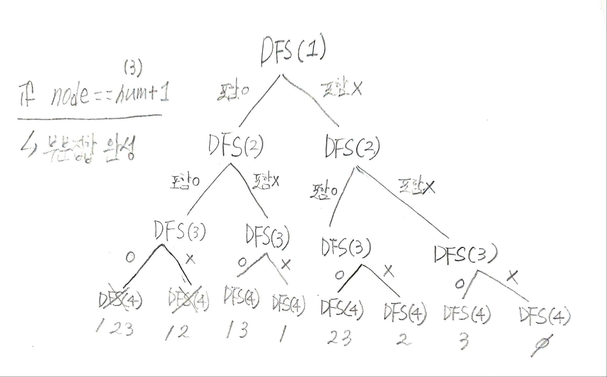
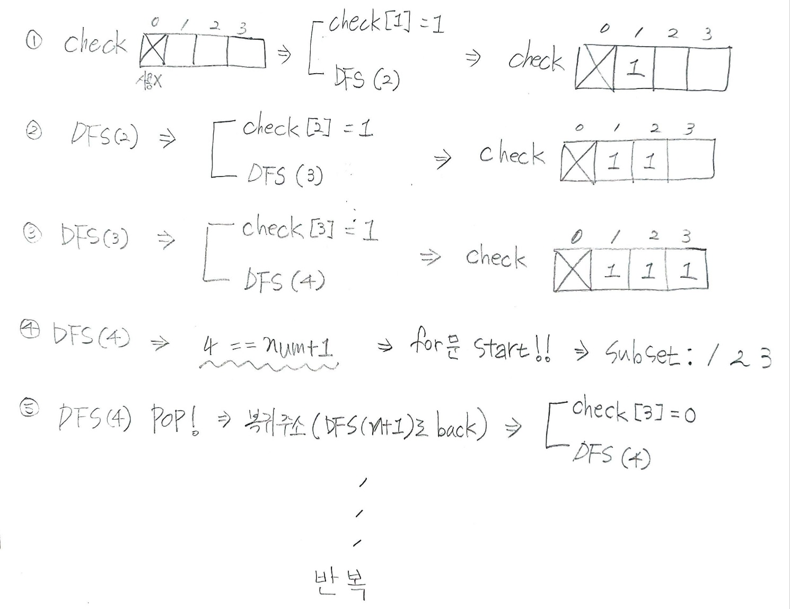

## ✍🏻 제목 : 부분집합 구하기
자연수 N이 주어지면 1부터 N까지의 원소를 갖는 집합의 부분집합을 모두 출력하는 프로그램을 작성하세요. 

- `입력조건` : 첫 번째 줄에 자연수 N(1 <= N <= 10)이 주어집니다.

- `출력조건` : 첫 번째 줄부터 각 줄에 하나씩 부분집합을 아래와 출력예제와 같은 순서로 출력한다. 단, 공집합은 출력하지 않습니다.

|입력예시|출력예시|
|:------:|:----:|
|3|1 2 3</br>1 2</br>1 3</br>1</br>2 3</br>2</br>3|</br>


</br>

---

### 🔍 이렇게 접근 했어요 !

```javascript
function solution(num) {
    let answer = [];
    // 0으로 초기화한 배열 생성
    let check = Array.from({ length: num + 1 }, () => 0);

    function DFS(n) {
        if(n === num + 1) {
            // 부분집합 문자열
            let subset = ""
            for(let i = 1; i <= num; i++) {
                // check[i] == 1 : 체크(포함)되어있다는 뜻
                if(check[i] == 1) subset += i + " ";
            }
            // 부분집합 누적 후 출력 (공집합 제외)
            if(subset.length > 0) answer.push(subset.trim());
        } else {
            check[n] = 1;  // 해당 숫자 노드 포함 O
            // 자식노드 두 갈래로
            DFS(n + 1);
            check[n] = 0;  // // 해당 숫자 노드 포함 X
            DFS(n + 1);
        }

    }
    DFS(1);
    return answer;
}
```




</br>

---

### 🐾 회고
오랜만에 알고리즘 풀이가 재밌다고 느껴졌다..! 알태기 세게 왔었는데 그림 그리면서 하니까 넘 재밌네. 근데 DFS 아직 너무 초심자라서 강의보고 해야하는 게 자존심 상한다. 그래도 어느정도 강사님이 설명하고 내가 알아서 그림 그리고 문제 이해해나가는 재미가 있음. 방학동안 강의 다 끝낼 수 있을까. 자꾸 조급해진다..