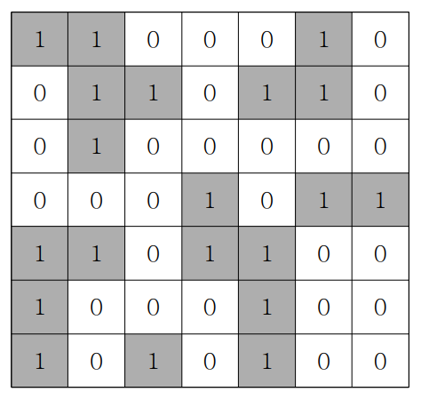

## ✍🏻 제목 : 섬나라 아일랜드(DFS 활용)
N*N의 섬나라 아일랜드의 지도가 격자판의 정보로 주어집니다. 각 섬은 1로 표시되어 상하좌우와 대각선으로 연결되어 있으며, 0은 바다입니다. 섬나라 아일랜드에 몇 개의 섬이 있는지 구하는 프로그램을 작성하세요.



만약 위와 같다면

- `입력조건` : 첫 번째 줄에 격자판 정보가 주어진다.

- `출력조건` : 첫 번째 줄에 섬의 개수를 출력한다.

|입력예시|출력예시|
|:------:|:----:|
|1 1 0 0 0 1 0</br>0 1 1 0 1 1 0</br>0 1 0 0 0 0 0</br>0 0 0 1 0 1 1</br>1 1 0 1 1 0 0</br>1 0 0 0 1 0 0</br>1 0 1 0 1 0 0|5|


</br>

---

### 🔍 이렇게 접근 했어요 !

```javascript
// 시계 방향으로 좌표 이동 배열 생성
const dx = [-1, -1, 0, 1, 1, 1, 0, -1]
const dy = [0, 1, 1, 1, 0, -1, -1, -1]
```

```javascript
function DFS(x, y) {
    // 섬 탐색 후 해당 칸은 0으로 바꿔줌. 그렇지 않을 시 무한 탐색할 수 있음.
    coorArr[x][y] = 0;
    
    // 방향 수에 따라 8번 반복 
    for(let k = 0; k < 8; k++) {
        let nx = x + dx[k];
        let ny = y + dy[k];

        if(nx >= 0 && nx < n && ny >=0 && ny < n && coorArr[nx][ny] === 1) {
            DFS(nx, ny);
        }
    }
}
```
다음 DFS()를 호출할 수 있을 때는 좌표를 벗어나지 않고 해당 칸이 섬(1)인 경우여야 한다.

```javascript
for(let i = 0; i < n; i++) {
    for(let j = 0; j < n; j++) {
        if(coorArr[i][j] === 1) {
            answer++;
            DFS(i, j);
        }
    }
}
return answer;
```
처음 섬(1)을 발견했을 때 answer를 +1해주어 섬의 개수를 카운트한다. 해당 섬의 나머지 부분들은 DFS()를 반복 탐색하며 0으로 체크될 것이므로 다시 반복 탐색할 일이 없게된다.