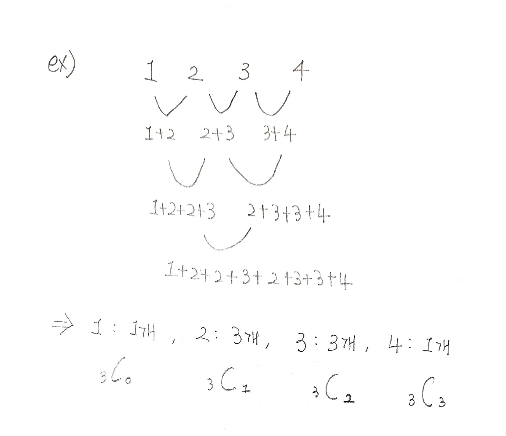

## ✍🏻 제목 : 수열 추측하기
가장 윗줄에 1부터 N까지의 숫자가 한 개씩 적혀 있다. 그리고 둘째 줄부터 차례대로 파스칼의 삼각형처럼 위의 두개를 더한 값이 저장되게 된다. 예를 들어 N이 4 이고 가장 윗 줄에 3 1 2 4 가 있다고 했을 때, 다음과 같은 삼각형이 그려진다.


N과 가장 밑에 있는 숫자가 주어져 있을 때 가장 윗줄에 있는 숫자를 구하는 프로그램을 작성하
시오. 단, 답이 여러가지가 나오는 경우에는 사전순으로 가장 앞에 오는 것을 출력하여야 한다.


- `입력조건` : 첫째 줄에 두개의 정수 N(1≤N≤10)과 F가 주어진다. N은 가장 윗줄에 있는 숫자의 개수를 의미하며 F는 가장 밑에 줄에 있는 수로 1,000,000 이하이다.

- `출력조건` : 첫째 줄에 삼각형에서 가장 위에 들어갈 N개의 숫자를 빈 칸을 사이에 두고 출력한다. 답이 존재하지 않는 경우는 입력으로 주어지지 않는다.

|입력예시|출력예시|
|:------:|:----:|
|4 16|3 1 2 4|


</br>

---

### 🔍 이렇게 접근 했어요 !

```javascript
function solution(c, endN) {
    let answer, flag = 0;
    let dy = Array.from(Array(11), () => Array(11).fill(0));
    let check = Array.from({ length: c + 1 }, () => 0);
    let p = Array.from({ length: c },() => 0);
    // 조합의 값을 담을 배열
    let b = Array.from({ length: c }, () => 0);

    function comb(n, r) {
        if(dy[n][r] > 0) return dy[n][r];
        if(n == r || r == 0) return 1;
        else return dy[n][r] = comb(n - 1, r - 1) + comb(n - 1, r);
    }

    function DFS(L, sum) {
        if(flag) return;
        if(L == c && sum == endN) {
            answer = p.slice();
            flag = 1;
        } else {
            for(let i = 1; i <= c; i++) {
                if(check[i] == 0) {
                    check[i] = 1;
                    p[L] = i;
                    DFS(L + 1, sum + (b[L] * p[L]));
                    check[i] = 0;
                }
            }
        }
    }

    for(let i = 0; i < c; i++) {
        b[i] = comb(c - 1, i);
    }

    DFS(0, 0);
    return answer;
}
```

조합 수를 `comb()`를 이용해 `b` 배열에 미리 저장한다.
재귀를 돌면서 숫자를 하나씩 선택할 때마다 sum에 `p[L] * b[L]`을 더해준다.
`L`과 `c`가 같고 `sum`과 `endN`이 같다면 하나의 답이 완성된 것이므로 p배열을 얕은 복사하여 `answer`에 할당해준다. 사전순으로 가장 앞에 오는 것을 출력해야하기 때문에 하나의 답이 완성되면 flag에 1을 할당하여 나머지를 모두 return한다.

</br>

---

### 🎉 새로 알게된 점은?
파스칼의 삼각형을 실행한 결과값이 이항계수를 이용해 계산한 최종값과 같음

