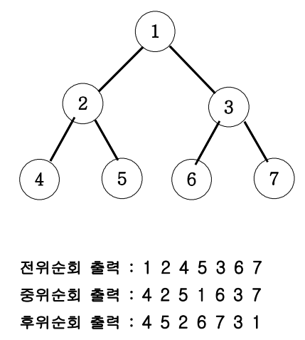

## ✍🏻 제목 : 이진트리 순회
아래 그림과 같은 이진트리를 전위순회와 후위순회를 연습해보세요.




</br>

---

### 🔍 이렇게 접근 했어요 !

```javascript
function solution(num) {
    function DFS(n) {
        if(n > 7) {
            return;
        } else {
            // 전위 순회
            console.log(n);
            DFS(n * 2);  // 왼쪽 자식노드로
            DFS(n * 2 + 1);  // 오른쪽 자식노드로

            // 중위 순회
            // DFS(n * 2);
            // console.log(n);
            // DFS(n * 2 + 1);

            // 후위 순회
            // DFS(n * 2);
            // DFS(n * 2 + 1);
            // console.log(n);
        }
    }
    DFS(num);
}

let num = 1;
solution(num);
```
DFS(1) 호출 -> 1 출력 -> DFS(2)호출(DFS(1) - 20 복귀주소 기억) -> ... 해당 순서로 반복이 끝날 때까지 계속함.

</br>

---

### 🎉 새로 알게된 점은?
전위 순회: 부모 노드 -> 왼쪽 자식 노드 -> 오른쪽 자식 노드
중위 순회: 왼쪽 자식 노드 -> 부모 노드 -> 오른쪽 자식 노드
후위 순휘: 왼쪽 자식 노드 -> 오른쪽 자식 노드 -> 부모 노드

</br>

---

### 🐾 회고
스택과 스택 프레임을 그려가며 복귀 주소가 어떻게 되는지, 어떻게 돌아오는지를 제대로 알 수 있었다. DFS 공부부터 확 어려워지는 것 같다.. 갈 길이 멀었다 !