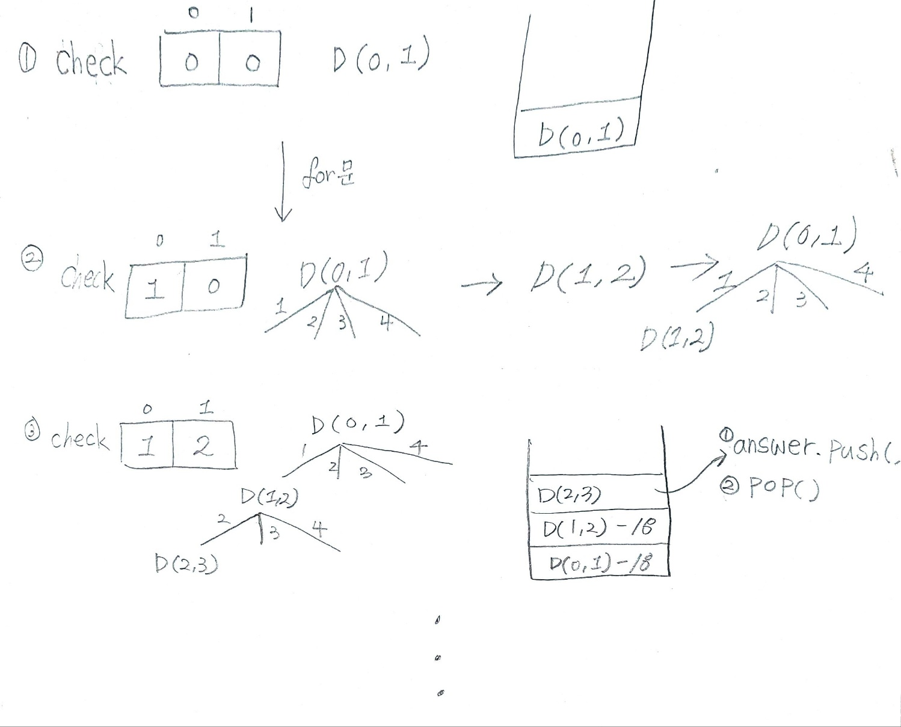

## ✍🏻 제목 : 조합 구하기
1부터 N까지 번호가 적힌 구슬이 있습니다. 이 중 M개를 뽑는 방법의 수를 출력하는 프로그램을 작성하세요.

- `입력조건` : 첫 번째 줄에 자연수 N(3<=N<=10)과 M(2<=M<=N) 이 주어집니다.

- `출력조건` : 첫 번째 줄에 결과를 출력합니다. 출력순서는 사전순으로 오름차순으로 출력합니다.

|입력예시|출력예시|
|:------:|:----:|
|4 2|1 2</br>1 3</br>1 4</br>2 3</br>2 4</br>3 4|


</br>

---

### 🔍 이렇게 접근 했어요 !

```javascript
    // s: start number (for문)
    function DFS(L, s) {
        if(L == c) {
            answer.push(check.slice());
        } else {
            for(let i = s; i <= n; i++) {
                check[L] = i;
                DFS(L + 1, i + 1);
            }
        }
    }
    DFS(0, 1);
    return answer;
```

