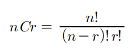
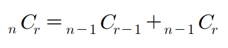

## ✍🏻 제목 : 조합의 경우수
 로 계산합니다. 하지만 여러분은 이 공식을 쓰지않고 다음 공식을 사용하여 
재귀를 이용해 조합수를 구해주는 프로그램을 작성하세요. 



- `입력조건` : 첫째 줄에 자연수 n(3 <= n <= 33)과 r(0 <= r <= n)이 입력됩니다.

- `출력조건` : 첫째 줄에 조합수를 출력합니다.

|입력예시|출력예시|
|:------:|:----:|
|5 3|10|


</br>

---

### 🔍 이렇게 접근 했어요 !

```javascript
function DFS(n, r) {
        if(n == r || r == 0) {  // 조합 결과가 1인 경우
            return 1;
        } else{
            return DFS(n - 1, r - 1) + DFS(n - 1, r);
        }
    }
    answer = DFS(n, r);
    return answer;
```

</br>

---

### 🐾 회고
전에 탐색한 조합과 같은 조합의 경우(2C1 등) 해당 조합에 따른 값을 이미 전에 계산한 적이 있기 때문에 이를 기억해두면 불필요한 계산의 반복이 줄어들어 시간적인 면에서 효율이 좋아질 것 같다. (메모이제이션)

```javascript
function solution(n, r) {
    let answer;
    let dy = Array.from(Array(3), () => Array(5).fill(0));

    function DFS(n, r) {
        if(dy[n][r] > 0) return dy[n][r];  // 메모이제이션 된 값일 경우 저장해놓은 값 반환
        if(n == r || r == 0) {
            return 1;
        } else{
            return dy[n][r] = DFS(n - 1, r - 1) + DFS(n - 1, r);
        }
    }
    answer = DFS(n, r);
    return answer;
}
```