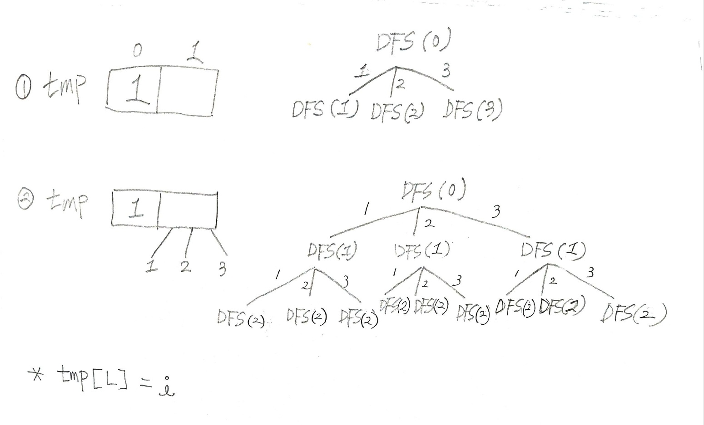

## ✍🏻 제목 : 중복순열 구하기
1부터 N까지 번호가 적힌 구슬이 있습니다. 이 중 중복을 허락하여 M번을 뽑아 일렬로 나열하는 방법을 모두 출력합니다.

- `입력조건` : 첫 번째 줄에 자연수 N(3<=N<=10)과 M(2<=M<=N) 이 주어집니다.

- `출력조건` : 첫 번째 줄에 결과를 출력합니다.출력순서는 사전순으로 오름차순으로 출력합니다.

|입력예시|출력예시|
|:------:|:----:|
|3 2|1 1</br>1 2</br>1 3</br>2 1</br>2 2</br>2 3</br>3 1</br>3 2</br>3 3|


</br>

---

### 🔍 이렇게 접근 했어요 !

```javascript
function solution(n, c) {
    let answer = [];
    let tmp = Array.from({length : c}, () => 0);

    function DFS(L) {
        // level 2에서 stop. 이중 for문 효과
        if(L == c) {
            // 깊은 복사
            answer.push(tmp.slice());
        } else {
            for(let i = 1; i <= n; i++) {
                tmp[L] = i;
                DFS(L + 1);
            }
        }
    }
    DFS(0);
    return answer;
}
```



</br>

---

### 🎉 새로 알게된 점은?
해당 문제는 **다중 for**으로도 구현할 수 있다. 하지만 다중 for문을 사용할 시 문제점은 M번 반복을 해서 중복순열을 출력해야할 시 M의 값이 바뀐다면 코드 다중 for문을 갯수도 증가해야하므로 코드를 매번 바꾸어야하는 **불편함**이 있다.

</br>

**얕은 복사**

얕은 복사란 객체를 복사할 때 기존 값과 복사된 값이 같은 참조를 가리키고 있는 것을 말한다. 복사된 객체의 인스턴스 변수는 원본 객체의 인스턴스 변수와 같은 메모리 **주소**를 참조한다. 따라서, 해당 메모리 주소의 값이 변경되면 원본 객체 및 복사 객체의 인스턴스 변수 값은 **같이 변경**된다.

**깊은 복사**
객체를 복사 할 때, 해당 객체와 인스턴스 변수까지 복사한다. 전부를 복사하여 새 주소에 담기 때문에 참조를 **공유하지 않는다.**


</br>

---

### 🐾 회고