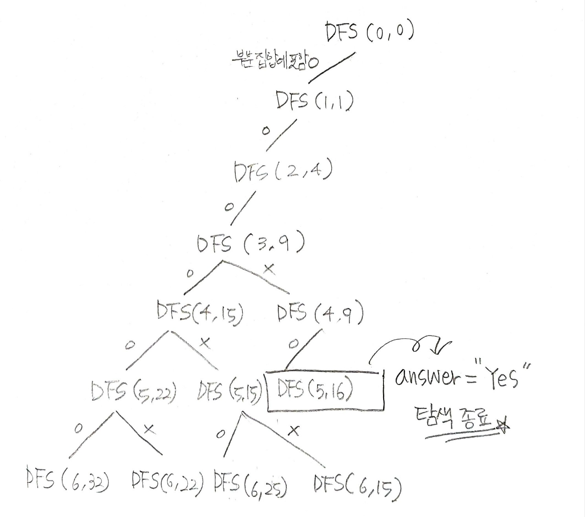

## ✍🏻 제목 : 합이 같은 부분집합
N개의 원소로 구성된 자연수 집합이 주어지면, 이 집합을 두 개의 부분집합으로 나누었을 때, 두 부분집합의 원소의 합이 서로 같은 경우가 존재하면 'YES"를 출력하고, 그렇지 않으면 
"NO"를 출력하는 프로그램을 작성하세요.

둘로 나뉘는 두 부분집합은 서로소 집합(Disjoint Set)이며, 두 부분집합을 합하면 입력으로 주어진 원래의 집합이 되어야 합니다.

예를 들어 {1, 3, 5, 6, 7, 10}이 입력되면 {1, 3, 5, 7} = {6, 10} 으로 두 부분집합의 합이 16으로 같은 경우가 존재하는 것을 알 수 있다.

- `입력조건` : 첫 번째 줄에 자연수 N(1<=N<=10)이 주어집니다. 두 번째 줄에 집합의 원소 N개가 주어진다. 각 원소는 중복되지 않으며, 그 크기는 1,000,000 이하입니다.

- `출력조건` : 첫 번째 줄에 “YES" 또는 ”NO"를 출력한다.

|입력예시|출력예시|
|:------:|:----:|
|6</br>1 3 5 6 7 10 |YES|


</br>

---

### 🔍 이렇게 접근 했어요 !

```javascript
function solution(numArr) {
    let answer = "NO";
    // numArr의 요소들의 전체 합
    let total = numArr.reduce((a, b) => a + b, 0);
    let len = numArr.length;

    // L: index
    function DFS(L, sum) {
        // 두 부분집합의 원소의 합이 서로 같은 경우가 존재할 시 바로 종료.
        if(answer == 'YES') return;
        if(L == len) {
            // 배열 원소 전체 합에서 한 부분 집합의 합을 뺀다면 나머지 부분집합의 합을 자연스럽게 구할 수 있음
            if((total - sum) == sum) {
                answer = "YES";
            }

        } else {
            DFS(L + 1, sum + numArr[L]);  // index 수 포함 O
            DFS(L + 1, sum);  // index 수 포함 X
        }
    }
    DFS(0, 0);
    return answer;
}
```
`DFS(L + 1, sum + numArr[L])`로 인덱스 위치의 수를 포함해나가고 `L == len`일 때 `answer`가 `YES`가 되지 않아 함수가 종료되지 않는다면 해당 스택의 복귀 주소로 돌아와 그 다음의 `DFS(L + 1, sum)`가 실행된다. 인덱스 위치의 수(`numArr[L]`)를 포함하지 않고 부분 집합을 각기 다르게 해나가며 깊이 우선 탐색을 해나가도록 설계하였다. 만약 `YES`가 나온다면 그 뒤의 탐색은 수행할 필요가 없으므로 효율성을 위해 바로 `return`하여 종료한다.


