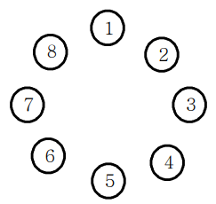
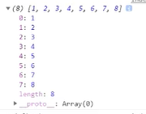

## ✍🏻 제목 : 공주 구하기
정보 왕국의 이웃 나라 외동딸 공주가 숲속의 괴물에게 잡혀갔습니다. 정보 왕국에는 왕자가 N명이 있는데 서로 공주를 구하러 가겠다고 합니다. 정보왕국의 왕은 다음과 같은 방법으로 공주를 구하러 갈 왕자를 결정하기로 했습니다.

왕은 왕자들을 나이 순으로 1번부터 N번까지 차례로 번호를 매긴다. 그리고 1번 왕자부터 N번 왕자까지 순서대로 시계 방향으로 돌아가며 동그랗게 앉게 한다. 그리고 1번 왕자부터 시계방향으로 돌아가며 1부터 시작하여 번호를 외치게 한다. 한 왕자가 K(특정숫자)를 외치면 그 왕자는 공주를 구하러 가는데서 제외되고 원 밖으로 나오게 된다. 그리고 다음 왕자부터 다시 1부터 시작하여 번호를 외친다.이렇게 해서 마지막까지 남은 왕자가 공주를 구하러 갈 수 있다.



예를 들어 총 8명의 왕자가 있고, 3을 외친 왕자가 제외된다고 하자. 처음에는 3번 왕자가 3을 외쳐 제외된다. 이어 6, 1, 5, 2, 8, 4번 왕자가 차례대로 제외되고 마지막까지 남게 된 7번 왕자에게 공주를 구하러갑니다.N과 K가 주어질 때 공주를 구하러 갈 왕자의 번호를 출력하는 프로그램을 작성하시오.

- `입력조건` : 첫 줄에 자연수 N(5<=N<=1,000)과 K(2<=K<=9)가 주어진다.

- `출력조건` : 첫 줄에 마지막 남은 왕자의 번호를 출력합니다.

|입력예시|출력예시|
|:------:|:----:|
|8 3|7|


</br>

---

### 🔍 이렇게 접근 했어요 !

```javascript
// 길이가 왕자의 수만큼인 유사배열객체 생성
// v: value, i: index
// (v, i) => i + 1 : index에 따른 값을 i + 1(1, 2, 3, ...) 해주기 
let queue = Array.from({length : princeNum}, (v, i) => i + 1);

while(queue.length) {
    for(let i = 0; i < num - 1; i++) {
        // 자료구조 큐를 이용하기 때문에 whift를 이용해 배열의 첫번째 요소를 제거해 주어야함.
        // 3을 외친 왕자가 아니기 때문에 다시 queue에 push
        queue.push(queue.shift());
    }
    // 3 외친 왕자 탈락
    queue.shift();

    // 배열 queue에 데이터가 하나(마지막 왕자) 남았을 때
    if(queue.length == 1) answer = queue.shift();
}
```
우선 왕자의 수만큼 자동적으로 배열이 생성되도록 Array.from() 메서드를 이용하여 왕자의 수와 같은 배열의 길이를 가지고 해당 인덱스의 +1(사람 수는 1명부터 시작하기 때문에)한 value를 가지는 queue 배열을 만든다. 



queue의 length가 0일때, 즉, 공주를 구하러 갈 왕자가 선택되었을 때 while을 빠져나오도록 한다. num보다 1 적은 수 만큼 반복문을 하고 (num을 외친 왕자는 제거되어야 함) 반복문을 돌 동안 queue에서 shift()를 이용하여 가장 첫번째의 왕자를 제거하고 3을 외치지 않은 왕자이니 다시 queue 배열에 push()해 배열의 가장 끝에 넣어준다. 반복문이 끝나면 3으 외친 왕자가 나오는 것이니 queue에서 완전히 제거해준다.

마지막으로 queue 배열의 길이가 1이라면(왕자가 한 명 남았다면) 공주를 구하러 갈 왕자가 결정된 것이니 shift()한 값을 answer에 넣어 문제를 해결할 수 있다.

</br>

---

### 🎉 새로 알게된 점은?
shift(): 배열에서 첫 번째 요소를 제거하고, 제거된 요소를 반환하는 메서드.

큐는 스택과 달리 한 쪽(맨 뒤)에서는 삽입이, 다른 한 쪽(맨 앞)에서는 제거가 이루어 지는 선입선출 구조이기 때문에 마지막 요소를 제거하는 pop()을 이용하지 못한다. 그렇기에 어떤 메서드를 사용해 큐의 방식처럼 맨 앞의 요소를 제거할 수 있을까 고민하였는데 shift()라는 메서드가 존재하였다. 

</br>

---

### 🐾 회고
요소 제거 메서드로 pop()만 생각하고 있었던지라 다른 메서드를 찾아볼 생각을 안했다.. 정말 반성중이다. 왜 모르는 걸 고민만 하고 검색해 볼 생각을 가끔씩 전혀 하지 못하는 것일까? 내가 아는 선에서만 한정해서 문제를 해결하려고 하는게 답답하다. 그래도 문제를 아니 점점 나아지겠지.. 제발 ㅎㅎ..