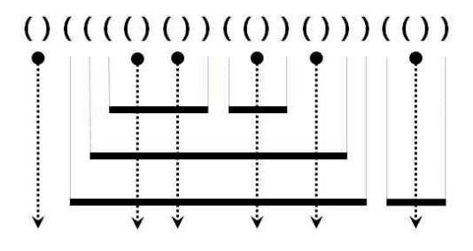
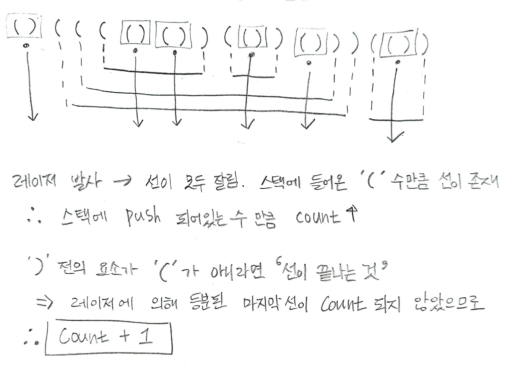

## ✍🏻 제목 : 쇠막대기
여러 개의 쇠막대기를 레이저로 절단하려고 한다. 효율적인 작업을 위해서 쇠막대기를 아래에서 위로 겹쳐 놓고, 레이저를 위에서 수직으로 발사하여 쇠막대기들을 자른다. 쇠막대기와 레이저의 배치는 다음 조건을 만족한다.

• 쇠막대기는 자신보다 긴 쇠막대기 위에만 놓일 수 있다. - 쇠막대기를 다른 쇠막대기 위에 놓는 경우 완전히 포함되도록 놓되, 끝점은 겹치지 않도록 놓는다.

• 각 쇠막대기를 자르는 레이저는 적어도 하나 존재한다.

• 레이저는 어떤 쇠막대기의 양 끝점과도 겹치지 않는다. 
아래 그림은 위 조건을 만족하는 예를 보여준다. 수평으로 그려진 굵은 실선은 쇠막대기이고, 점은 레이저의 위치, 수직으로 그려진 점선 화살표는 레이저의 발사 방향이다.



이러한 레이저와 쇠막대기의 배치는 다음과 같이 괄호를 이용하여 왼쪽부터 순서대로 표현할 수 있다.
1. 레이저는 여는 괄호와 닫는 괄호의 인접한 쌍 ‘( ) ’ 으로 표현된다. 또한, 모든 ‘( ) ’는 반드시 레이저를 표현한다.
2. 쇠막대기의 왼쪽 끝은 여는 괄호 ‘ ( ’ 로, 오른쪽 끝은 닫힌 괄호 ‘) ’ 로 표현된다. 

위 예의 괄호 표현은 그림 위에 주어져 있다.

쇠막대기는 레이저에 의해 몇 개의 조각으로 잘려지는데, 위 예에서 가장 위에 있는 두 개의 쇠막대기는 각각 3개와 2개의 조각으로 잘려지고, 이와 같은 방식으로 주어진 쇠막대기들은 총 17개의 조각으로 잘려진다. 
쇠막대기와 레이저의 배치를 나타내는 괄호 표현이 주어졌을 때, 잘려진 쇠막대기 조각의 총 개수를 구하는 프로그램을 작성하시오.

- `입력조건` : 한 줄에 쇠막대기와 레이저의 배치를 나타내는 괄호 표현이 공백없이 주어진다. 괄호 문자의 개수는 최대 100,000이다. 

- `출력조건` : 잘려진 조각의 총 개수를 나타내는 정수를 한 줄에 출력한다.

|입력예시|출력예시|
|:------:|:----:|
|()(((()())(())()))(())|17|


</br>

---

### 🔍 이렇게 접근 했어요 !

```javascript
for(let i = 0; i < bar.length; i++) {
    if(bar[i] == '(') stack.push(bar[i]);
    else {
        stack.pop();
        // 레이저를 쏜 상황
        if(bar[i - 1] == '(') {
            // 스택에 있는 '(' 갯수만큼(막대 수만큼) count에 추가
            // 막대가 있는데 중간에 레이저가 있다면 막대 수만큼 잘렸을 테니까 
            count += stack.length;

        // 막대가 끝난 상황
        } else count += 1;
    }
}
```

</br>

---

### 🎉 새로 알게된 점은?


</br>

---

### 🐾 회고
문제에 대한 설명이 길고 복잡하다고 해서 코드까지 그러리라는 법은 없다는 것을 알게 되었다. 문제가 길고 그림설명가지 나오면 어려운 문제이겠거니 괜히 지레짐작하고 겁먹었던 것 같다. 예외 상황만 몇 가지 생각하면 쉬운 난이도의 문제인데도 말이다. 아직도 어려운 문제를 맞닥뜨리면 회피하고 싶어하는 마음이 너무 잘 느껴져 부끄럽다. 언제쯤이면 회피하지 않고 자신감을 가지고 풀 수 있을까? ㅜ.ㅜ 원하는 모습이 되기까지의 못난 순간들이 힘들 줄은 알았지만 생각보다 더 힘든 것 같다. 조급해지지 말자. 그러지말자..