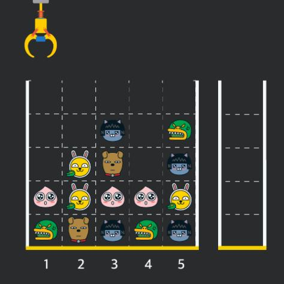
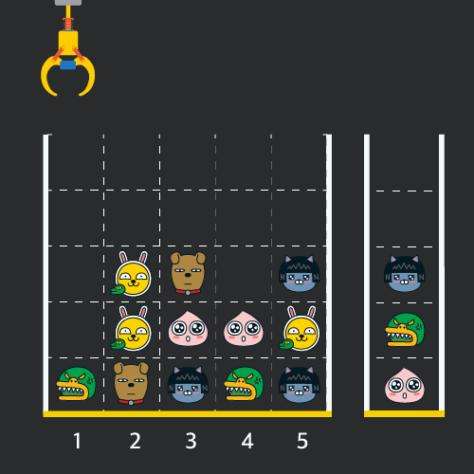

## ✍🏻 제목 : 크레인 인형뽑기
게임개발자인 죠르디는 크레인 인형뽑기 기계를 모바일 게임으로 만들려고 합니다.
죠르디는 게임의 재미를 높이기 위해 화면 구성과 규칙을 다음과 같이 게임 로직에 반영하려고 합니다.



게임 화면은 1 x 1 크기의 칸들로 이루어진 N x N 크기의 정사각 격자이며 위쪽에는 크레인이 있고 오른쪽에는 바구니가 있습니다. (위 그림은 5 x 5 크기의 예시입니다). 각 격자 칸에는 다양한 인형이 들어 있으며 인형이 없는 칸은 빈칸입니다. 모든 인형은 1 x 1 크기의 격자 한 칸을 차지하며 격자의 가장 아래 칸부터 차곡차곡 쌓여 있습니다. 

게임 사용자는 크레인을 좌우로 움직여서 멈춘 위치에서 가장 위에 있는 인형을 집어 올릴 수 있습니다. 집어 올린 인형은 바구니에 쌓이게 되는 데, 이때 바구니의 가장 아래 칸부터 인형이 순서대로 쌓이게 됩니다. 다음 그림은 [1번, 5번, 3번] 위치에서 순서대로 인형을 집어 올려 바구니에 담은 모습입니다.



만약 같은 모양의 인형 두 개가 바구니에 연속해서 쌓이게 되면 두 인형은 터뜨려지면서 바구니에서 사라지게 됩니다. 위 상태에서 이어서 [5번] 위치에서 인형을 집어 바구니에 쌓으면 같은 모양 인형 두 개가 없어집니다.크레인 작동 시 인형이 집어지지 않는 경우는 없으나 만약 인형이 없는 곳에서 크레인을 작동시키는 경우에는 아무런 일도 일어나지 않습니다. 또한 바구니는 모든 인형이 들어갈 수 있을 만큼 충분히 크다고 가정합니다. (그림에서는 화면표시 제약으로 5칸만으로 표현하였음) 

게임 화면의 격자의 상태가 담긴 2차원 배열 board와 인형을 집기 위해 크레인을 작동시킨 위치가 담긴 배열 moves가 매개변수로 주어질 때, 크레인을 모두 작동시킨 후 터트려져 사라진 인형의 개수를 return 하도록 solution 함수를 완성해주세요.


- `입력조건` : board 배열은 2차원 배열로 크기는 5 x 5 이상 30 x 30 이하입니다. board의 각 칸에는 0 이상 100 이하인 정수가 담겨있습니다.
0은 빈 칸을 나타냅니다. 1 ~ 100의 각 숫자는 각기 다른 인형의 모양을 의미하며 같은 숫자는 같은 모양의 인형을 나타냅니다. moves 배열의 크기는 1 이상 1,000 이하입니다. moves 배열 각 원소들의 값은 1 이상이며 board 배열의 가로 크기 이하인 자연수입니다.

- `출력조건` : 터트려져 사라진 인형의 개수를 출력하세요.

|입력예시|출력예시|
|:------:|:----:|
|[[0,0,0,0,0],[0,0,1,0,3],[0,2,5,0,1],[4,2,4,4,2],[3,5,1,3,1]] </br> [1,5,3,5,1,2,1,4]|4|


</br>

---

### 🔍 이렇게 접근 했어요 !

```javascript
// 크레인의 현재 위치 탐색
moves.forEach(pos => {
    for(let i = 0; i < board.length; i++) {
        // 인형 catch
        if(board[i][pos - 1] != 0) {
            let doll = board[i][pos - 1];
            board[i][pos - 1] = 0;

            if(doll == basket[basket.length - 1]) {
                basket.pop();
                count += 2;  // 인형 두 개 pop
            } 
            else basket.push(doll);
            break;  // 인형 한 개를 꺼낸뒤 break 해주지않으면 해당 열의 있는 인형 전부를 꺼내도록 동작함.
        }
    }
});
```
**크레인의 위치**를 `forEach()` 메서드를 통해 탐색하며 해당 위치에 따른 동작을 수행한다. `board`의 `행`의 길이만큼 반복문을 수행하며 만약 `board[i][pos - 1]`가 **0이 아니**라면, 즉, **인형이 존재**하는 곳이라면 우서 해당 위치를 `doll` 변수에 저장하고 해당 위치의 인형을 꺼내 바구니로 옮겨 담아야하기 때문에 위치의 값을 `0`으로 만들어준다. 

그리고 바구니에 담기전 뽑기 기계에 있던 인형(숫자)과 바구니 스택에 가장 끝(`top`)에 위치한 인형의 종류가 **같다**면 뽑기 기계에서 뽑은 인형은 바구니 스택에 담지 않고 현재 바구니 스택의 `top`에 위치한 인형은 `pop()`하여 **제거**해준다. 인형이 두 개 제거 되었으니 `count`는 **2 증가**시켜준다. 같지 않다면 꺼낸 인형을 바구니에 넣어준다. 그다음, 현재 크레인이 위치한 열의 인형을 **다시 뽑지 않기** 위해 `break`하여 해당 열을 탐색을 그만하고 빠져나간다. 

</br>

```javascript
for(let pos of moves) {
    for(let i = 0; i < board.length; i++) {
        // 인형 catch
        if(board[i][pos - 1] != 0) {
            let doll = board[i][pos - 1];
            board[i][pos - 1] = 0;
            if(doll == basket[basket.length - 1]) {
                basket.pop();
                count += 2;  // 인형 두 개 pop
            } 
            else basket.push(doll);
            break;  // 인형 한 개를 꺼낸뒤 break 해주지 않으면 해당 열의 있는 인형 전부를 꺼내도록 동작함.
        }
    }
}
```
forEach를 for...of문으로 바꾸어 보았다. 나에게는 for...of 방법이 더 잘맞는 듯 하다.

</br>

---

### 🐾 회고
board[i][pos - 1]을 0으로 바꾸기 전 값을 변수에 저장해주지 않아 후에 조건을 판별할 때 board[i][pos - 1]이 항상 0이 되어버린다는 사실을 놓쳐 원하는 답이 계속 나오지 않아 고생했다 하하.. 그리고 한번 인형을 뽑고 조건을 탐색한 뒤 break를 해주지 않으면 해당 열의 인형을 모조리 뽑게 된다는 사실도 ..  