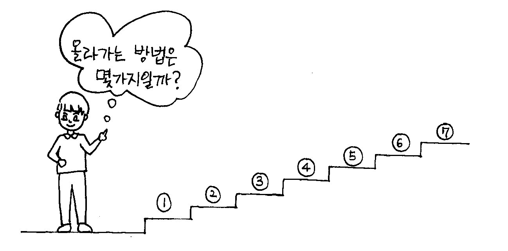

## ✍🏻 제목 : 계단 오르기
철수는 계단을 오를 때 한 번에 한 계단 또는 두 계단씩 올라간다. 만약 총 4계단을 오른다면 
그 방법의 수는 1+1+1+1, 1+1+2, 1+2+1, 2+1+1, 2+2 로 5가지이다. 

그렇다면 총 N계단일 때 철수가 올라갈 수 있는 방법의 수는 몇 가지인가?



- `입력조건` : 첫째 줄은 계단의 개수인 자연수 N(3≤N≤45)이 주어집니다.

- `출력조건` : 첫 번째 줄에 올라가는 방법의 수를 출력합니다.

|입력예시|출력예시|
|:------:|:----:|
|7|21|


</br>

---

### 🔍 이렇게 접근 했어요 !

```javascript
let answer = 0;
// 해당 인덱스 위치의 계단까지 가는 방법의 수를 저장하는 배열
let mArr = Array.from({ length: s + 1 }, () => 0);

// 1계단, 2계단 올라가는 방법 수 초기화
mArr[1] = 1;
mArr[2] = 2;

for(let i = 3; i <= s; i++) {
    mArr[i] = mArr[i - 2] + mArr[i - 1];
}
answer = mArr[s];
return answer;
```
mArr은 인덱스가 0부터 시작하기 때문에 s보다 1 큰 길이로 배열을 생성해야 한다.

3계단: 1계단, 2계단에서 올라갈 수 있음
4계단: 2계단, 3계단에서 올라갈 수 있음
5계단: 3계단, 4계단에서 올라갈 수 있음
.
.
. 

</br>

---

### 🎉 새로 알게된 점은?
동적계획법은 아주 작은 단위의 문제의 크기로 쪼개어서 해당 답을 저장해놓고 점차적으로 문제의 크기를 넓혀가야 한다. 이 문제 같은 경우는 계단의 목적지를 1칸에서 원래 정말 최종적으로 도착해야하는 목적지까지 점차적으로 목적지를 확대해나가는 방법을 사용하면 되었다.