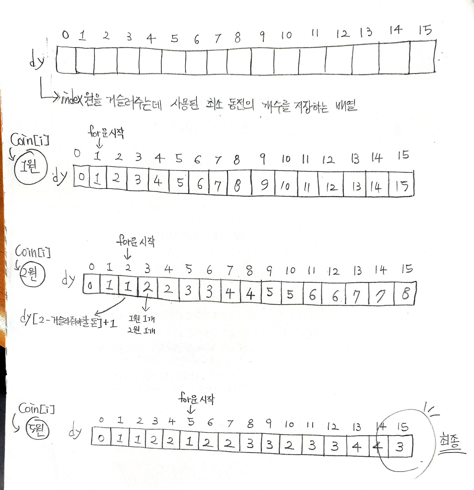

## ✍🏻 제목 : 동전교환
다음과 같이 여러 단위의 동전들이 주어져 있을때 거스름돈을 가장 적은 수의 동전으로 교환해주려면 어떻게 주면 되는가? 각 단위의 동전은 무한정 쓸 수 있다.

- `입력조건` : 첫 번째 줄에는 동전의 종류개수 N(1<=N<=12)이 주어진다. 두 번째 줄에는 N개의 동전의 종류가 주어지고, 그 다음줄에 거슬러 줄 금액 M(1<=M<=500)이 주어진다. 각 동전의 종류는 100원을 넘지 않는다.

- `출력조건` : 첫 번째 줄에 거슬러 줄 동전의 최소개수를 출력한다.

|입력예시|출력예시|
|:------:|:----:|
|3</br>1 2 5</br>15|3|


</br>

---

### 🔍 이렇게 접근 했어요 !

```javascript
let dy = Array.from({ length: m + 1 }, () => 1000);
dy[0] =0;  // 초기화

for(let i = 0; i < coin.length; i++) {
    // 현재 coin 단위부터 반복 시작
    // 거슬러줘야하는 돈 m원까지 반복 
    for(let j = coin[i]; j <= m; j++) {
        // dy[j]: j금액을 거슬러 줄 때 사용되는 동전의 최소 개수 (Math.min() 사용)
        dy[j] = Math.min(dy[j], dy[j - coin[i]] + 1);
    }
}
answer = dy[m];
```

