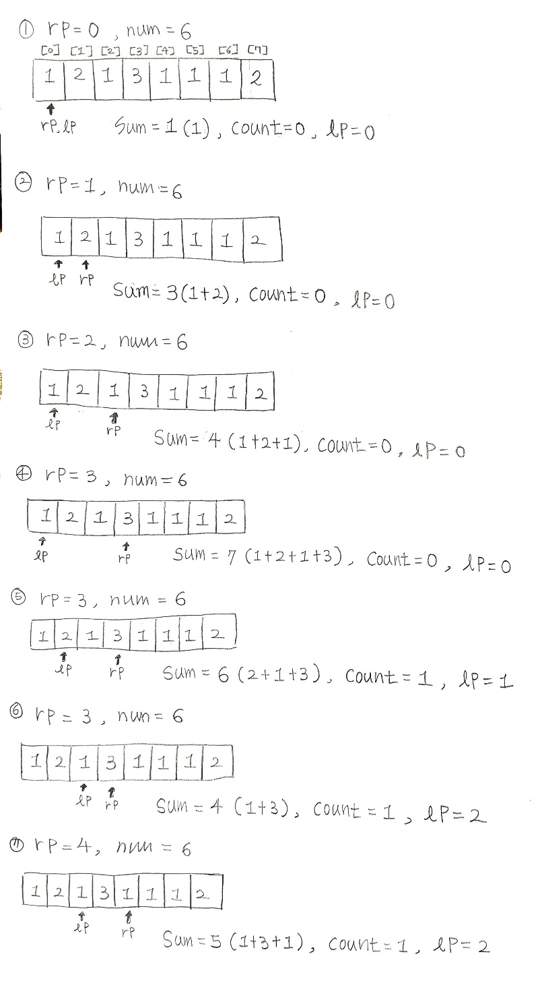
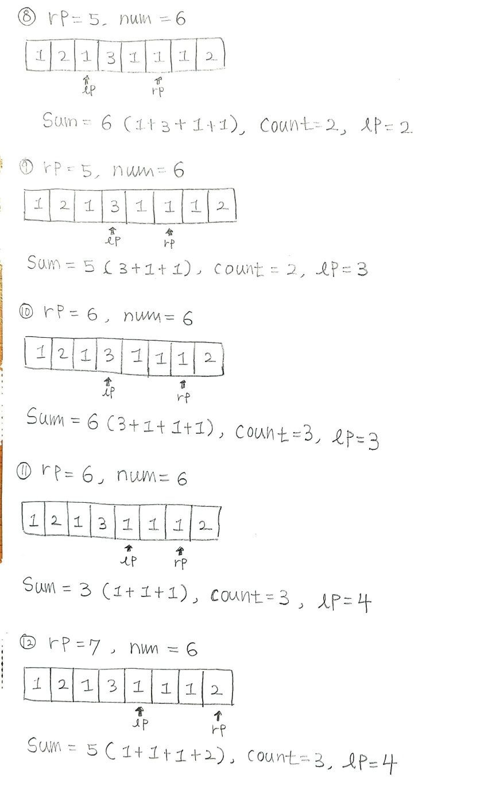

## ✍🏻 제목 : 연속 부분 수열 1
N개의 수로 이루어진 수열이 주어집니다.
이 수열에서 연속부분수열의 합이 특정숫자 M이 되는 경우가 몇 번 있는지 구하는 프로그램을 작성하세요.

만약 N=8, M=6이고 수열이 다음과 같다면

1 2 1 3 1 1 1 2 

합이 6이 되는 연속부분수열은 {2, 1, 3}, {1, 3, 1, 1}, {3, 1, 1, 1}로 총 3가지입니다.

- `입력조건` : 첫째 줄에 N(1≤N≤100,000), M(1≤M≤100,000,000)이 주어진다. 수열의 원소값은 1,000을 넘지 않는 자연수이다.

- `출력조건` : 첫째 줄에 경우의 수를 출력한다.

|입력예시|출력예시|
|:------:|:----:|
|8 6</br>1 2 1 3 1 1 1 2|3|

</br>

---

### 🔍 이렇게 접근 했어요 !

```javascript
for(let rp = 0; rp < numArr.length; rp++) {
        sum += numArr[rp];
        if(sum == num) count++; 
        while(sum >= num) {
            sum -= numArr[lp++]; // 포인터 lp위치 오른쪽으로 이동
            if(sum == num) count++;
        }
    }
```
`lp`는 **왼쪽 포인터**, `rp`는 **오른쪽 포인터**로 설정하고 매 **반복문이 끝**나면 `rp`가 **오른쪽으로 이동**하는 형태로 큰 구조를 잡았다. 

우선 반복문 시작에 `sum`과 현재 탐색중인 `rp` 포인터가 위치한 곳의 수를 **더해**주어 `sum`을 업데이트 해준다. 만약 업데이트된 `sum`이 특정 숫자 `num`과 **같다**면 **연속부분수열**이 얼마나 있는지를 세어주는 `count`를 **1증가** 시켜준다. 

`sum`이 `num`보다 **크거나 혹은 같은** 경우에도 `lp`을 **오른쪽**으로 옮겨주고 원래 `lp`가 위치했던 곳의 **수**만큼을 `sum`에서 **빼주어야**한다. 그래야 새로 만들어지는 수열과 합에 해당 수가 포함되지 않기 때문이다. 그리고 `lp`를 옮긴 후 업데이트된 `sum`이 `num`과 **같은지** 다시 검사해주어 맞다면 역시 `count`를 **증가**시킨다. 

글로만 보면 동작 과정이 잘 그려지지 않을 수 있으니 그림을 통해 해당 과정을 이해해보았다.





</br>

---

### 🐾 회고
동작 과정을 이렇게 자세하게 처음부터 끝까지 손으로 그려보는 것은  처음이었는데 절대 잊지 않을 것 같다 ㅋㅋㅋㅋㅋ 애매하게 이해하고 넘어가려 했는 뇌에 진하게 새겨넣은 기분이다. 오래걸렸지만 손으로 차근차근 반복문의 코드 한줄 한줄을 계산하고 대입해나가니 훨씬 흥미롭고 잘 이해되었다.