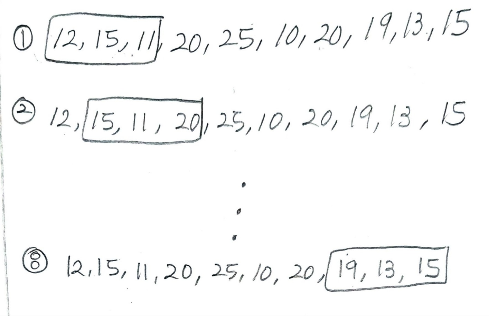

## ✍🏻 제목 : 최대 매출
현수의 아빠는 제과점을 운영합니다. 현수 아빠는 현수에게 N일 동안의 매출기록을 주고 연속된 K일 동안의 최대 매출액이 얼마인지 구하라고 했습니다.

만약 N = 10이고 10일 간의 매출기록이 아래와 같습니다. 이때 K=3이면 
12 15 `11 20 25` 10 20 19 13 15
연속된 3일간의 최대 매출액은 11 + 20 + 25 = 56 만원입니다.

여러분이 현수를 도와주세요.


- `입력조건` : 첫 줄에 N(5<=N<=100,000)과 K(2<=K<=N)가 주어집니다.
두 번째 줄에 N개의 숫자열이 주어집니다. 각 숫자는 500이하의 음이 아닌 정수입니다.

- `출력조건` : 첫 줄에 최대 매출액을 출력합니다

|입력예시|출력예시|
|:------:|:----:|
|10 3</br>12 15 11 20 25 10 20 19 13 15|56|


</br>

---

### 🔍 이렇게 접근 했어요 !

```javascript
for(let end = 0; end < day; end++) {
    sum += saleArr[end];
}
max = sum;

for(let end = day; end < saleArr.length; end++) {
    sum = sum + saleArr[end] - saleArr[start++];
    if(sum > max) max = sum;
}
```
더해야하는 매출액이 `day`로 미리 지정이 되어있기 때문에 **3일의 매출액**을 한 블록으로 잡고 가장 처음 시작시 반복문을 통해 첫날 매출액부터 3일째 매출액까지, 즉, `saleArr[0] ~ saleArr[2]`까지 더해주고(`sum`) 그 수를 `max`에 저장해주었다. 

그런 다음, **다음 블록의 합**을 구해야하기 때문에 포인터 `end = 3`을 시작으로 하여 기존 `sum`에 **4일째** 되는날의 매출액(`saleArr[3]`)을 더하고 블록이 **오른쪽으로 한 칸씩 이동**하기 때문에 **첫 날 매출액**인 현재 `start` 포인터가 위치한 `saleArr[0]`을 빼주었다. 그리고 `start`를 **1 증가** 시켜주어 포인터를 오른쪽으로 옮긴다. 

말로 설명하면 잘 와닿지 않는 것 같으니 그림을 통해 보자면



이런식으로 3일을 매출액을 하나의 블록처럼 이동시키며 더해주는 방식이다.

</br>

---

### 🐾 회고
오늘도 그림을 그려서 마무리 설명을 자신에게 해보았다. 다음 알고리즘 풀이부터는 그림을 처음부터 그려보고 알고리즘 구조를 구상해봐야 하나? 투포인터로 풀이를 하니 쓸데없는 for문도 줄이고 포인터의 이동을 통해 위치의 이동 등을 더 확실히 알 수 있게 되어 좋은 것 같다. 처음 포인터 문제를 풀라고 했을때 그럼 3개, 4개의 포인터를 사용해도 되나? 라고 생각했던 과거의 내가 갑자기 떠오르는 오늘이다..ㅎㅎ 그때보다는 발전했겠지 ! 암 그렇고말고 !