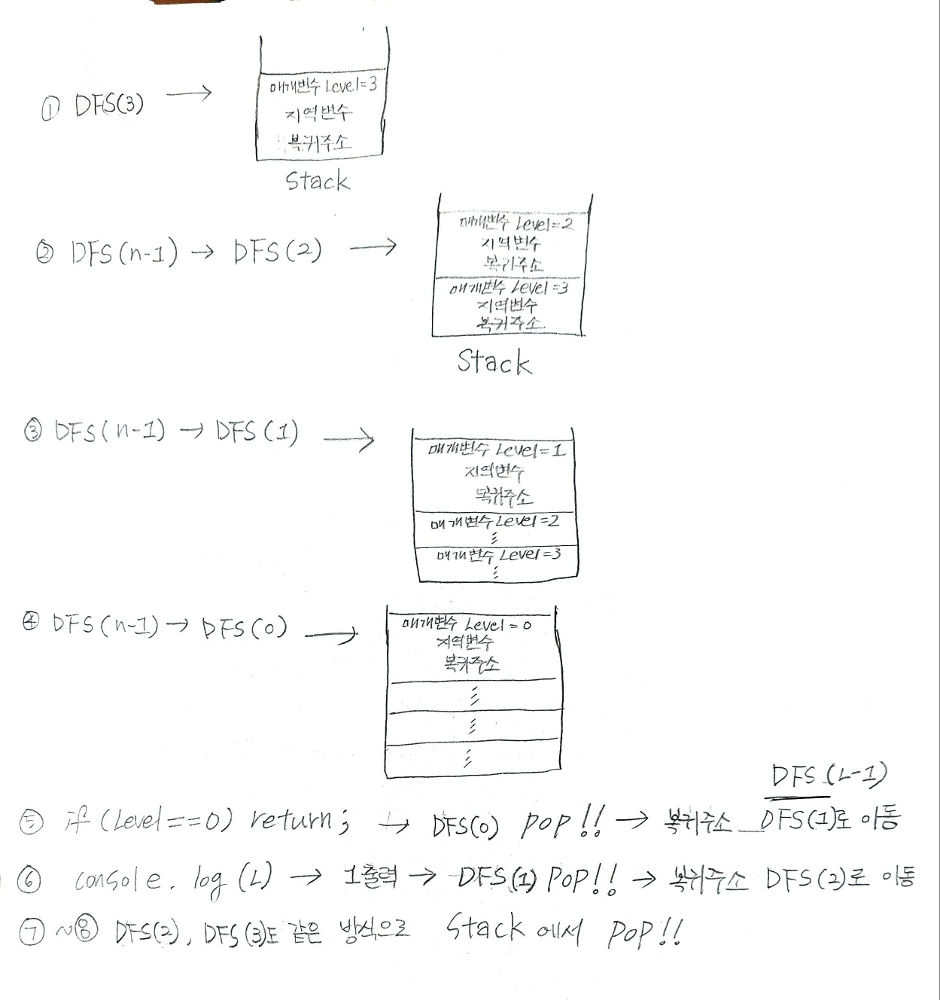

## ✍🏻 제목 : 재귀함수
자연수 N이 입력되면 재귀함수를 이용하여 1부터 N까지를 출력하는 프로그램을 작성하세요.

- `입력조건` : 첫 번째 줄은 정수 N(3 <= N <= 10)이 입력된다.

- `출력조건` : 첫째 줄에 출력한다.

|입력예시|출력예시|
|:------:|:----:|
|3|1 2 3|


</br>

---

### 🔍 이렇게 접근 했어요 !

```javascript
function solution(num) {
    function DFS(Level) {
        // 여기서의 return은 '종료'의 의미
        if(Level == 0) return;
        else {
            DFS(Level - 1);
            console.log(Level);
        }
    }
    DFS(num);
}

let num = 3;
solution(num);
```


</br>

---

### 🎉 새로 알게된 점은?
재귀 함수에 대해 알려면 우선 스택 프레임에 대해 알아야 한다.

함수가 호출될 때 스택에는 함수의 **매개변수**, 함수 호출이 끝난 뒤 돌아갈 **반환 주소값**, 함수 내부 **지역 변수**가 저장된다. 이렇게 스택 영역에 차례대로 저장되는 `함수의 호출 정보`를 Stack Frame이라고 한다.

호출된 함수들의 작업이 완료되어 반환되면 해당 함수의 스택 프레임이 스택에서 제거(pop)된다.
