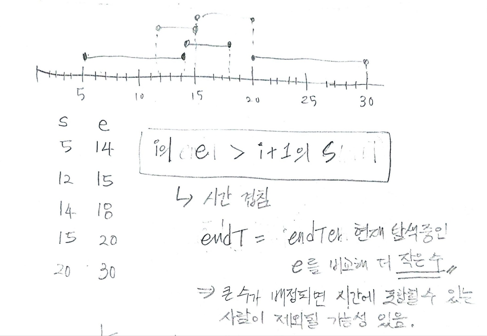

## ✍🏻 제목 : 결혼식
현수는 다음 달에 결혼을 합니다. 현수는 결혼식 피로연을 장소를 빌려 3일간 쉬지 않고 하려고 합니다. 피로연에 참석하는 친구들 N명의 참석하는 시간정보를 현수는 친구들에게 미리 요구했습니다. 각 친구들은 자신이 몇 시에 도착해서 몇 시에 떠날 것인지 현수에게 알려주었습니다.

현수는 이 정보를 바탕으로 피로연 장소에 동시에 존재하는 최대 인원수를 구하여 그 인원을 수용할 수 있는 장소를 빌리려고 합니다. 여러분이 현수를 도와주세요.
만약 한 친구가 오는 시간 13, 가는시간 15라면 이 친구는 13시 정각에 피로연 장에 존재하는 것이고 15시 정각에는 존재하지 않는다고 가정합니다.

- `입력조건` : 첫째 줄에 피로연에 참석할 인원수 N(5<=N<=100,000)이 주어집니다. 두 번째 줄부터 N줄에 걸쳐 각 인원의 오는 시간과 가는 시간이 주어집니다. 시간은 첫날 0시를 0으로 해서 마지막날 밤 12시를 72로 하는 타임라인으로 오는 시간과 가는 시간이 음이 아닌 정수로 표현됩니다.

- `출력조건` : 첫째 줄에 피로연장에 동시에 존재하는 최대 인원을 출력하세요.

|입력예시|출력예시|
|:------:|:----:|
|5</br>14 18</br>12 15</br>15 20</br>20 30</br>5 14|2|


</br>

---

### 🔍 이렇게 접근 했어요 !

```javascript
timeArr.sort((a, b) => {
    if(a[0] == b[0]) return a[1] - b[1];
    else return a[0] - b[0];
})

let endT = Number.MAX_SAFE_INTEGER;
let count = 0;
for(let i of timeArr) {
    if(i[0] < endT) {
        count++;
        endT = Math.min(i[1], endT);
    }
}
```
우선 친구들의 참여 시간을 오는 시간 기준으로 오름차순 해주었다. 그리고 가는 시간을 담을 endT에 Number.MAX_SAFE_INTEGER 안전한 최대 정수값을 담아 초기화해주었다. 피로연장에 동시에 존재하는 최대 인원을 세어주기 위해 count 변수도 0으로 초기화했다. 그리고 참여시간 배열을 반복문을 이용해 돌면서 탐색하고 탐색 중인 친구의 오는 시간이 endT보다 작을때 count를 1증가시켜 세어주고 endT에는 endT와 탐색 중인 친구의 가는 시간을 비교하여 더 작은 수를 넣어준다. 

더 작은 수를 넣어주는 이유는 만약 endT에 더 큰 수를 넣어준다면 현재 카운트 한 수에 포함되어있는 친구의 가는 시간보다 높아지고 그렇다면 포함된 친구 중 갈 시간이 되어 간 친구를 포함하고 있는 상태가 될 수도 있기 때문에 이 점을 유의해주었다.

