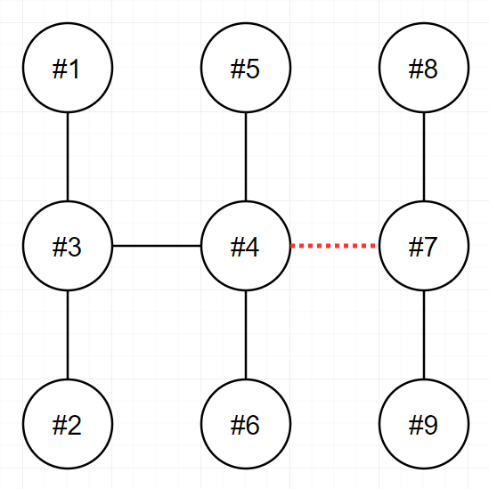

## ✍🏻 제목 : 전력망을 둘로 나누기
n개의 송전탑이 전선을 통해 하나의 트리 형태로 연결되어 있습니다. 당신은 이 전선들 중 하나를 끊어서 현재의 전력망 네트워크를 2개로 분할하려고 합니다. 이때, 두 전력망이 갖게 되는 송전탑의 개수를 최대한 비슷하게 맞추고자 합니다.

송전탑의 개수 n, 그리고 전선 정보 wires가 매개변수로 주어집니다. 전선들 중 하나를 끊어서 송전탑 개수가 가능한 비슷하도록 두 전력망으로 나누었을 때, 두 전력망이 가지고 있는 송전탑 개수의 차이(절대값)를 return 하도록 solution 함수를 완성해주세요.

#### 제한사항
- n은 2 이상 100 이하인 자연수입니다.
- wires는 길이가 n-1인 정수형 2차원 배열입니다.
    - wires의 각 원소는 [v1, v2] 2개의 자연수로 이루어져 있으며, 이는 전력망의 v1번 송전탑과 v2번 송전탑이 전선으로 연결되어 있다는 것을 의미합니다.
    - 1 ≤ v1 < v2 ≤ n 입니다.
    - 전력망 네트워크가 하나의 트리 형태가 아닌 경우는 입력으로 주어지지 않습니다.

|n|wires|result|
|:------:|:----:|:-----:|
|9|[[1,3],[2,3],[3,4],[4,5],[4,6],[4,7],[7,8],[7,9]]|3|
|4|[[1,2],[2,3],[3,4]]|0|
|7|[[1,2],[2,7],[3,7],[3,4],[4,5],[6,7]]|1|

**입출력 예 설명**

입출력 예 #1

- 다음 그림은 주어진 입력을 해결하는 방법 중 하나를 나타낸 것입니다.

- 
- 4번과 7번을 연결하는 전선을 끊으면 두 전력망은 각 6개와 3개의 송전탑을 가지며, 이보다 더 비슷한 개수로 전력망을 나눌 수 없습니다.
- 또 다른 방법으로는 3번과 4번을 연결하는 전선을 끊어도 최선의 정답을 도출할 수 있습니다.

**입출력 예 #2**

- 다음 그림은 주어진 입력을 해결하는 방법을 나타낸 것입니다.
- 
- 2번과 3번을 연결하는 전선을 끊으면 두 전력망이 모두 2개의 송전탑을 가지게 되며, 이 방법이 최선입니다.

**입출력 예 #3**

- 다음 그림은 주어진 입력을 해결하는 방법을 나타낸 것입니다.
- 
- 3번과 7번을 연결하는 전선을 끊으면 두 전력망이 각각 4개와 3개의 송전탑을 가지게 되며, 이 방법이 최선입니다.

</br>

---

### 🔍 이렇게 접근 했어요 !

```javascript
function solution(n, wires) {
    var answer = Number.MAX_SAFE_INTEGER;

    // 트리 생성
    let tree = Array.from({ length: n + 1 }, () => []);

    for(const [v1, v2] of wires) {
        tree[v1].push(v2);
        tree[v2].push(v1);
    }

    function bfs(root, exceptN) {
        let count = 0;
        let visited = [];
        let queue = [root];
        visited[root] = true;

        while(queue.length) {
            let index = queue.pop();
            tree[index].forEach((e) => {
                if(e !== exceptN && visited[e] !== true) {
                    visited[e] = true;
                    queue.push(e);
                }
            })
            count++;
        }
        return count;
    }
    wires.forEach((e) => {
        let [a, b] = e;
        answer = Math.min(answer, Math.abs(bfs(a, b) - bfs(b, a)));
    });
    return answer;
}
```
우선 노드끼리 어떻게 연결되어 있는지를 나타내기 위해 tree를 생성한다. Array.from을 이용한 빈 배열을 생성하고 반복문으로 wires를 순회하며 각 전선의 연결 상태를 tree에 추가한다.

tree[index]는 노드 index가 가진 연결된 노드들의 목록이며 forEach를 이용해 이 목록에 있는 각 노드(e)에 대해서 연결된 노드를 확인하고, 아직 방문하지 않았고(visited === false) 제외할 노드가 아니라면 queue에 추가하고 방문 처리한다. 노드를 방문할 때마다 count를 증가시켜 노드의 갯수를 세어준다.

wires를 순회하면서 각 전선을 끊었을 때의 전력망을 두 개로 나누고, 두 전력망의 송전탑 개수 차이를 계산한다. 그 차이가 현재 answer보다 작으면 answer를 해당 차로 바꾸어준다. bfs(a, b)와 bfs(b, a)를 호출하여 각각 a와 b를 시작점으로 하고, 서로를 제외한 나머지 노드들을 탐색하면 간접적으로 a와 b를 연결하는 간선을 제거한 것과 같은 효과를 얻을 수 있다.