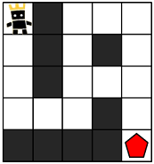
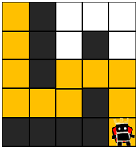
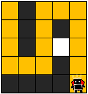
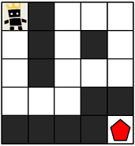
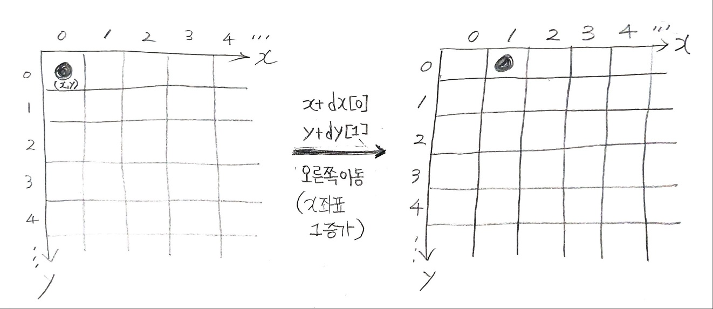

## ✍🏻 제목 : 게임 맵 최단거리
ROR 게임은 두 팀으로 나누어서 진행하며, 상대 팀 진영을 먼저 파괴하면 이기는 게임입니다. 따라서, 각 팀은 상대 팀 진영에 최대한 빨리 도착하는 것이 유리합니다.

지금부터 당신은 한 팀의 팀원이 되어 게임을 진행하려고 합니다. 다음은 5 x 5 크기의 맵에, 당신의 캐릭터가 (행: 1, 열: 1) 위치에 있고, 상대 팀 진영은 (행: 5, 열: 5) 위치에 있는 경우의 예시입니다.



위 그림에서 검은색 부분은 벽으로 막혀있어 갈 수 없는 길이며, 흰색 부분은 갈 수 있는 길입니다. 캐릭터가 움직일 때는 동, 서, 남, 북 방향으로 한 칸씩 이동하며, 게임 맵을 벗어난 길은 갈 수 없습니다.
아래 예시는 캐릭터가 상대 팀 진영으로 가는 두 가지 방법을 나타내고 있습니다.

위 그림에서 검은색 부분은 벽으로 막혀있어 갈 수 없는 길이며, 흰색 부분은 갈 수 있는 길입니다. 캐릭터가 움직일 때는 동, 서, 남, 북 방향으로 한 칸씩 이동하며, 게임 맵을 벗어난 길은 갈 수 없습니다.
아래 예시는 캐릭터가 상대 팀 진영으로 가는 두 가지 방법을 나타내고 있습니다.

- 첫 번째 방법은 11개의 칸을 지나서 상대 팀 진영에 도착했습니다.



- 두 번째 방법은 15개의 칸을 지나서 상대팀 진영에 도착했습니다.



위 예시에서는 첫 번째 방법보다 더 빠르게 상대팀 진영에 도착하는 방법은 없으므로, 이 방법이 상대 팀 진영으로 가는 가장 빠른 방법입니다.

만약, 상대 팀이 자신의 팀 진영 주위에 벽을 세워두었다면 상대 팀 진영에 도착하지 못할 수도 있습니다. 예를 들어, 다음과 같은 경우에 당신의 캐릭터는 상대 팀 진영에 도착할 수 없습니다.



게임 맵의 상태 maps가 매개변수로 주어질 때, 캐릭터가 상대 팀 진영에 도착하기 위해서 지나가야 하는 칸의 개수의 최솟값을 return 하도록 solution 함수를 완성해주세요. 단, 상대 팀 진영에 도착할 수 없을 때는 -1을 return 해주세요.

#### 제한사항
- maps는 n x m 크기의 게임 맵의 상태가 들어있는 2차원 배열로, n과 m은 각각 1 이상 100 이하의 자연수입니다. n과 m은 서로 같을 수도, 다를 수도 있지만, n과 m이 모두 1인 경우는 입력으로 주어지지 않습니다.
- maps는 0과 1로만 이루어져 있으며, 0은 벽이 있는 자리, 1은 벽이 없는 자리를 나타냅니다.
- 처음에 캐릭터는 게임 맵의 좌측 상단인 (1, 1) 위치에 있으며, 상대방 진영은 게임 맵의 우측 하단인 (n, m) 위치에 있습니다.

|입력예시|출력예시|
|:------:|:----:|
|[[1,0,1,1,1],[1,0,1,0,1],[1,0,1,1,1],[1,1,1,0,1],[0,0,0,0,1]]|11|


</br>

---

### 🔍 이렇게 접근 했어요 !

```javascript
function solution(maps) {
    const dx = [0, 1, 0, -1];
    const dy = [1, 0, -1, 0];
    const xLen = maps.length;
    const yLen = maps[0].length;
    const goalX = xLen - 1;
    const goalY = yLen - 1;

    const queue = [];
    // [시작 x좌표, 시작 y좌표, 이동거리 카운트]          
    queue.push([0, 0, 1]);
    
    while(queue.length) {
        // queue에서 현재 x좌표, 현재 y좌표, 이동한 거리를 반환
        const [curX, curY, move] = queue.shift();

        // [xLen - 1, yLen - 1] 도착 지점의 좌표
        if(curX === goalX && curY === goalY) return move;

        for(let i = 0; i < 4; i++) {
            const nx = curX + dx[i];
            const ny = curY + dy[i];

            if(nx >= 0 && nx < xLen && ny >= 0 && ny < yLen && maps[nx][ny] === 1) {
                queue.push([nx, ny, move + 1]);
                maps[nx][ny] = 0;
            }
        }
    } 
    return -1;
}
```
우선 dx, dy 배열은 2차원 행렬 상에서 상하좌우로 이동할 때 사용하기 위한 이동 변화량 배열이다. dx[0], dy[0]은 오른쪽, dx[1], dy[1]은 아래쪽, dx[2], dy[2]는 왼쪽, dx[3], dy[3]은 위쪽으로 이동할 때의 변화량을 나타낸다. 



만약 위의 그림처럼 현재 위치가 (x, y)이고 x + dx[0], y + dy[0]을 해준다면 현재 위치가 오른쪽으로 한 칸 이동하게 되는 것이다.

queue에서 이동거리를 1이라고 push하는 이유는 시작을 한 (0, 0)의 위치도 이동한 거리에 포함해야하기 때문이다.

최단 거리 문제는 BFS로 푸는 것이 좋기 때문에 while문을 이용해 BFS를 시작한다. 우선 현재 위치가 목표 지점의 좌표와 같다면 목표에 도달한 것이므로 탐색이 종료되며 이동 거리를 반환한다.

하지만 목표 지점에 아직 도달하지 않은 상태라면 상하좌우 탐색을 하며 이동해야 하기 때문에 4번 반복문을 돌며 탐색 및 이동한다. 만약 탐색 중인 좌표가 x, y 모두 0이상, 좌표 길이 이하로 좌표를 벗어나지 않으며, 탐색 좌표가 벽(0)이 아니라 이동할 수 있는 길(1)이라면 queue에 move를 1증가시켜 push해준다. 그리고 현재 이동한 위치는 다시 탐색하여 혼란을 주지 않도록 0으로 업데이트 시킨다. 

</br>

---

### 🎉 새로 알게된 점은?
최단 거리 문제에 BFS를 사용하는 이유는 무엇일까.우선 최단 경로를 빠르게 찾을 수 있는 당연한 이유가 있다. BFS는 시작점에서 거리가 1인 정점을 모두 방문한 후 다음으로 2인 정점, 3인 정점 .. 이렇게 탐색해나가기 때문에 가장 빠른 경로를 먼저 찾을 수 있다. 단, 이는 그 가중치들이 모두 동일할 때 얘기이다. 

DFS는 깊이 우선 탐색이라는 특징때문에 현재 경로상의 노드를 끝까지 탐색해야 하기 때문에 불필요한 탐색을 할 여지가 있다. 또한 BFS에서는 필요하지 않은 추가적인 backtracking 과정이 필요하기 때문에 잘 사용되지 않는 것 같다.