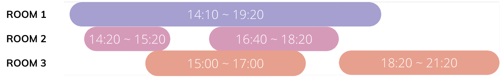

## ✍🏻 제목 : 호텔 대실
호텔을 운영 중인 코니는 최소한의 객실만을 사용하여 예약 손님들을 받으려고 합니다. 한 번 사용한 객실은 퇴실 시간을 기준으로 10분간 청소를 하고 다음 손님들이 사용할 수 있습니다.

예약 시각이 문자열 형태로 담긴 2차원 배열 book_time이 매개변수로 주어질 때, 코니에게 필요한 최소 객실의 수를 return 하는 solution 함수를 완성해주세요.

#### 제한사항
- 1 ≤ book_time의 길이 ≤ 1,000
  - book_time[i]는 ["HH:MM", "HH:MM"]의 형태로 이루어진 배열입니다
    - [대실 시작 시각, 대실 종료 시각] 형태입니다.
  - 시각은 HH:MM 형태로 24시간 표기법을 따르며, "00:00" 부터 "23:59" 까지로 주어집니다.
    - 예약 시각이 자정을 넘어가는 경우는 없습니다.
    - 시작 시각은 항상 종료 시각보다 빠릅니다.

|book_time|result|
|:------:|:----:|
|[["15:00", "17:00"], ["16:40", "18:20"], ["14:20", "15:20"], ["14:10", "19:20"], ["18:20", "21:20"]]|3|
|[["09:10", "10:10"], ["10:20", "12:20"]]|1|
|[["10:20", "12:30"], ["10:20", "12:30"], ["10:20", "12:30"]]|3|

**입출력 예 #1**


위 사진과 같습니다.

입출력 예 #2

첫 번째 손님이 10시 10분에 퇴실 후 10분간 청소한 뒤 두 번째 손님이 10시 20분에 입실하여 사용할 수 있으므로 방은 1개만 필요합니다.

입출력 예 #3

세 손님 모두 동일한 시간대를 예약했기 때문에 3개의 방이 필요합니다.

</br>

---

### 🔍 이렇게 접근 했어요 !

```javascript
const changeInt = (time) => { 
  // 주어진 타임스탬프를 분으로 바꿔주는 함수
  let [hour, minute] = time.split(':');
  return parseInt(hour)*60 + parseInt(minute);
}

const solution = (book_time) => {
  let answer = [];
  
  book_time.sort().forEach(time => {
      // 입실 시간, 퇴실 시간을 각각 바꿔주기
      const start = changeInt(time[0]);
      const end = changeInt(time[1]);
      
      if (answer.length === 0) {
          answer.push(end + 10);
      } else {
          answer = answer.sort(); // 가장 이른 시간으로 정렬
          let flag = true; // 방 교환되었는지 체크하는 변수
          for (let i=0; i<answer.length; i++) {
              if (answer[i] <= start) {
                  // 입실시간보다 빠른 청소되어있는 방이 있으면
                  answer[i] = end + 10; // 퇴실시간 + 10
                  flag = false; // 체크
                  break;
              }
          }
          // 체크가 한번도 안됐으면 새로운 방에 퇴실시간 + 10
          if (flag) answer.push(end + 10);
      }
  });
  
  return answer.length;
}
```