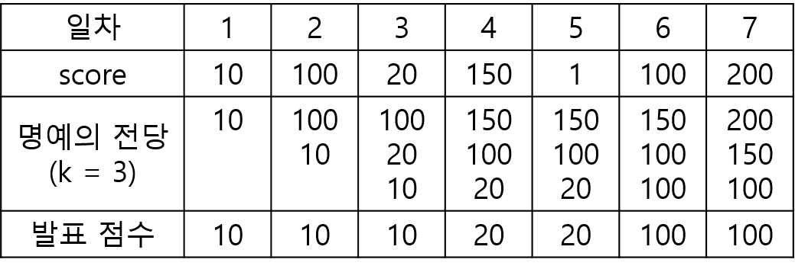
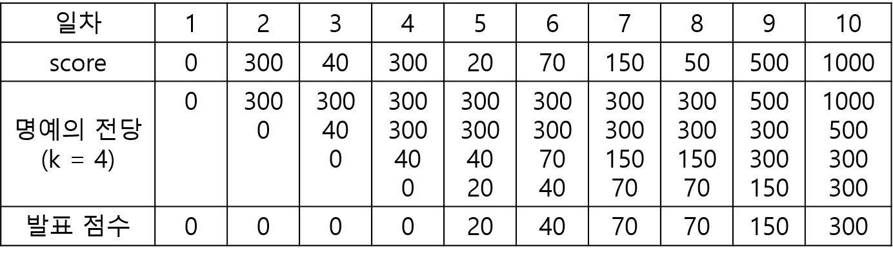

## ✍🏻 제목 : 명예의 전당(1)
명예의 전당"이라는 TV 프로그램에서는 매일 1명의 가수가 노래를 부르고, 시청자들의 문자 투표수로 가수에게 점수를 부여합니다. 매일 출연한 가수의 점수가 지금까지 출연 가수들의 점수 중 상위 k번째 이내이면 해당 가수의 점수를 명예의 전당이라는 목록에 올려 기념합니다. 즉 프로그램 시작 이후 초기에 k일까지는 모든 출연 가수의 점수가 명예의 전당에 오르게 됩니다. k일 다음부터는 출연 가수의 점수가 기존의 명예의 전당 목록의 k번째 순위의 가수 점수보다 더 높으면, 출연 가수의 점수가 명예의 전당에 오르게 되고 기존의 k번째 순위의 점수는 명예의 전당에서 내려오게 됩니다.

이 프로그램에서는 매일 "명예의 전당"의 최하위 점수를 발표합니다. 예를 들어, k = 3이고, 7일 동안 진행된 가수의 점수가 [10, 100, 20, 150, 1, 100, 200]이라면, 명예의 전당에서 발표된 점수는 아래의 그림과 같이 [10, 10, 10, 20, 20, 100, 100]입니다.



명예의 전당 목록의 점수의 개수 k, 1일부터 마지막 날까지 출연한 가수들의 점수인 score가 주어졌을 때, 매일 발표된 명예의 전당의 최하위 점수를 return하는 solution 함수를 완성해주세요.

#### 제한사항
- 3 ≤ k ≤ 100
- 7 ≤ score의 길이 ≤ 1,000
  - 0 ≤ score[i] ≤ 2,000

|k|score|result|
|:------:|:----:|:----:|
|3|[10, 100, 20, 150, 1, 100, 200]|[10, 10, 10, 20, 20, 100, 100]|
|4|[0, 300, 40, 300, 20, 70, 150, 50, 500, 1000]|[0, 0, 0, 0, 20, 40, 70, 70, 150, 300]|

**입출력 예 설명**

입출력 예 #1 </br>
- 문제의 예시와 같습니다.

입출력 예 #2 </br>
- 아래와 같이, [0, 0, 0, 0, 20, 40, 70, 70, 150, 300]을 return합니다.



</br>

---

### 🔍 이렇게 접근 했어요 !

```javascript
function solution(k, score) {
  let answer = [];

  // k 담는 배열 numArr
  let numArr = [];
  
  score.forEach(num => {
      numArr.push(num);
      numArr.sort((a, b) => b - a).splice(k);
      answer.push(Math.min.apply(null, numArr));
  });

  return answer;
}
```

`forEach()`를 이용해 score에 담긴 점수를 하나씩 꺼낸 후 numArr에 넣어주고 해당 배열을 내림차순 정렬한다. `splice()`를 이용해 k번까지 잘라낸 다음 numArr 값 중 최솟값을 구한다.

</br>

---

### 🎉 새로 알게된 점은?
`Math.min.apply()` 

ex) const arr = [4,3,2,1];

const minNumber = Math.min.apply(null, arr); // 1

null 을 첫번째 인자로 사용하면 context는 window 객체가 된다.
위와 같이 사용하면 두번째 인자의 배열의 값을 순서대로 호출한 메서드의 인자로 보내 실행한다.