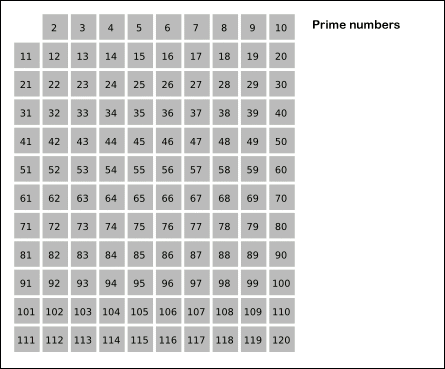

## ✍🏻 제목 : 소수 찾기
1부터 입력받은 숫자 n 사이에 있는 소수의 개수를 반환하는 함수, solution을 만들어 보세요.

소수는 1과 자기 자신으로만 나누어지는 수를 의미합니다.
(1은 소수가 아닙니다.)

#### 제한사항
- n은 2이상 1000000이하의 자연수입니다.

|n|result|
|:------:|:----:|
|10|4|
|5|3|

</br>

---

### 🔍 이렇게 접근 했어요 !

```javascript
function solution(n) {
  let answer = 0;
  const arr = Array.from({ length: n + 1 }).fill(true);
  arr[0] = arr[1] = false;
  const sqrt = parseInt(Math.sqrt(n));

  for(let i = 2; i <= sqrt; i++) {
    if(arr[i] === true) {
      for(let j = 2; i * j <= n; j++) {
        arr[i * j] = false;
      }
    }
  }
  answer = arr.filter((v) => v === true).length;
  return answer;
}  
```
에라토스테네스의 체를 이용하여 구현하였다.

</br>

---

### 🎉 새로 알게된 점은?
**에라토스테네스의 체**
에라토스테네스님께서 발견한 소수를 찾는 방법.

1. 2부터 순회를 하면서 2의 배수 모두 제거.
2. 3부터 순회를 하면서 3의 배수를 모두 제거. 
3. 4는 이미 2를 순회할 때 제거되었으므로 패스. 
4. 5의 배수를 제거
... 
주어진 수의 제곱근까지 확인하면 종료.


(출처: https://ko.wikipedia.org/wiki/%ED%8C%8C%EC%9D%BC:Sieve_of_Eratosthenes_animation.gif)

</br>

---

### 🐾 회고