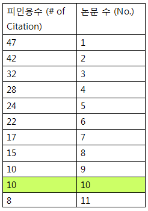

## ✍🏻 제목 : H-Index
H-Index는 과학자의 생산성과 영향력을 나타내는 지표입니다. 어느 과학자의 H-Index를 나타내는 값인 h를 구하려고 합니다. 위키백과1에 따르면, H-Index는 다음과 같이 구합니다.

어떤 과학자가 발표한 논문 n편 중, h번 이상 인용된 논문이 h편 이상이고 나머지 논문이 h번 이하 인용되었다면 h의 최댓값이 이 과학자의 H-Index입니다.

어떤 과학자가 발표한 논문의 인용 횟수를 담은 배열 citations가 매개변수로 주어질 때, 이 과학자의 H-Index를 return 하도록 solution 함수를 작성해주세요.

#### 제한사항
- 과학자가 발표한 논문의 수는 1편 이상 1,000편 이하입니다.
- 논문별 인용 횟수는 0회 이상 10,000회 이하입니다.

|citations|return|
|:------:|:----:|
|[3, 0, 6, 1, 5]|3|

**입출력 예 설명**

이 과학자가 발표한 논문의 수는 5편이고, 그중 3편의 논문은 3회 이상 인용되었습니다. 그리고 나머지 2편의 논문은 3회 이하 인용되었기 때문에 이 과학자의 H-Index는 3입니다.

</br>

---

### 🔍 이렇게 접근 했어요 !

```javascript
function solution(citations) {
    let answer = 0;
    const len = citations.length;

    // 내림차순 정렬
    citations.sort((a, b) => {return b - a});

    for(let i = 0; i < len; i++) {
        if(i + 1 <= citations[i]) {
            answer++;
        }
    }
    return answer;
}
```
citations 배열을 내림차순, 즉, 인용 횟수가 큰 순서대로 정렬한다.
i + 1은 현재까지 확인한 인용 횟수의 개수를, citations[i]는 인용 횟수가 i번 이상인 논문의 개수를 의미한다. i + 1이 citations[i]보다 작거나 같은 경우, 인용 횟수가 i번 이상인 논문의 개수가 i + 1개 이상이므로 H-Index의 조건을 만족한다.

1. [3, 0, 6, 1, 5] => [6, 5, 3, 1, 0]
2. i = 0: i + 1 = 1, citations[i] = 6 / 6은 1번 이상 인용된 논문의 개수 => 조건 충족
.
.
.
i = 3, i + 1 = 4, citations[i] = 1 / 조건 충족 X

</br>

---

### 🎉 새로 알게된 점은?
**H-지수 구하는 방법**


출처: https://www.ibric.org/bric/trend/bio-series.do?mode=series_view&newsArticleNo=8802417&articleNo=8882714&beforeMode=latest_list#!/list

표와 같이 자신이 저널에 등재한 전체 논문중 많이 인용된 순으로 정렬한 후, 피인용수가 논문수와 같아지거나 피인용수가 논문수보다 작아지기 시작하는 숫자가 바로 나의 h가 된다. 위 표에서는 10이 H-지수가 되는 것이며, 이 연구원은 논문 인용횟수가 10이 넘는 논문이 적어도 10편이 된다는 것을 의미한다.