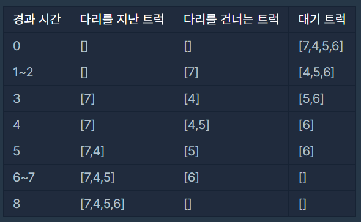

## ✍🏻 제목 : 다리를 지나는 트럭
트럭 여러 대가 강을 가로지르는 일차선 다리를 정해진 순으로 건너려 합니다. 모든 트럭이 다리를 건너려면 최소 몇 초가 걸리는지 알아내야 합니다. 다리에는 트럭이 최대 bridge_length대 올라갈 수 있으며, 다리는 weight 이하까지의 무게를 견딜 수 있습니다. 단, 다리에 완전히 오르지 않은 트럭의 무게는 무시합니다.

예를 들어, 트럭 2대가 올라갈 수 있고 무게를 10kg까지 견디는 다리가 있습니다. 무게가 [7, 4, 5, 6]kg인 트럭이 순서대로 최단 시간 안에 다리를 건너려면 다음과 같이 건너야 합니다.



따라서, 모든 트럭이 다리를 지나려면 최소 8초가 걸립니다.

solution 함수의 매개변수로 다리에 올라갈 수 있는 트럭 수 bridge_length, 다리가 견딜 수 있는 무게 weight, 트럭 별 무게 truck_weights가 주어집니다. 이때 모든 트럭이 다리를 건너려면 최소 몇 초가 걸리는지 return 하도록 solution 함수를 완성하세요.

#### 제한사항
- bridge_length는 1 이상 10,000 이하입니다.
- weight는 1 이상 10,000 이하입니다.
- truck_weights의 길이는 1 이상 10,000 이하입니다.
- 모든 트럭의 무게는 1 이상 weight 이하입니다.

|bridge_length|weight|truck_weights|return|
|:------:|:----:|:----:|:----:|
|2|10|[7,4,5,6]|8|
|100|100|[10]|101|
|100|100|[10,10,10,10,10,10,10,10,10,10]|110|

</br>

---

### 🔍 이렇게 접근 했어요 !

```javascript
function solution(bridge_length, weight, truck_weights) {
    let sec = 0;
    
    // 다리 위에 올라간 트럭
    let trOnbr = Array.from({ length: bridge_length }, () => 0);
    // 다리 위에 올라간 트럭의 무게
    let bridgeWeight = 0;

    sec++;
    trOnbr.shift();
    bridgeWeight += truck_weights[0];
    trOnbr.push(truck_weights.shift());

    while(bridgeWeight > 0) {
        sec++;
        bridgeWeight -= trOnbr.shift();

        if(truck_weights.length > 0 && bridgeWeight + truck_weights[0] <= weight) {
            bridgeWeight += truck_weights[0];
            trOnbr.push(truck_weights.shift());
        } else {
            trOnbr.push(0);
        }
    }
    return sec;
}
```
queue의 특징을 이용해 문제를 풀어보았다. 다리 위에 올라간 트럭의 상태를 나타내는 배열인 `trOnbr`와 다리 위에 올라간 트럭의 무게를 나타내는 `bridgeWeight`를 각각 생성한다. 처음에는 아무 트럭도 다리에없는 상태이기에 배열과 변수 다 0으로 채워준다.

방식은 trOnbr의 0번 인덱스가 다리의 도착지점, -1번 인덱스가 다리의 출발 지점이라고 생각하는 것이다. 만약 다음 트럭이 다리에 올라온다면 trOnbr의 -1번 인덱스에 해당 트럭을 추가한다. 트럭은 매 초마다 한 칸씩 앞으로 이동한다 (인덱스 -1). `sec++`로 1초가 지나면 다리에 트럭을 올린다. `truck_weights`의 첫 요소가 처음 다리에 올라가는 트럭이 되며 trOnbr의 끝에 요소를 push하고 이 트럭의 무게를 bridgeWeight에 더한다. 다리 전체 길이를 초과하면 안되므로 trOnbr의 첫 요소를 shift()하여 제거한다. 

다음으로 1초가 또 지나고 트럭이 다리를 건너면 해당 요소를 없애고 그 무게를 bridgeWeight에서 빼준다. 다음 트럭이 다리에 올라오고 싶을 때 만약 다리가 견딜 수 있는 무게보다 bridgeWeight에 다음 트럭의 무게(truck_weights[0])의 합이 작다면 해당 트럭을 다리에 올린다. 무겁다면 trOnbr에 0을 push 한다. 이는 다리 위에 트럭이 아닌 빈 공간을 만들어주어 다리의 길이를 유지한다.

다리의 현재 하중이 0이 되는 순간을 모든 트럭이 다리를 다 건넌 순간으로 판단하여 최소 걸린 시간 sec을 반환해준다.

</br>

---

### 🎉 새로 알게된 점은?


</br>

---

### 🐾 회고